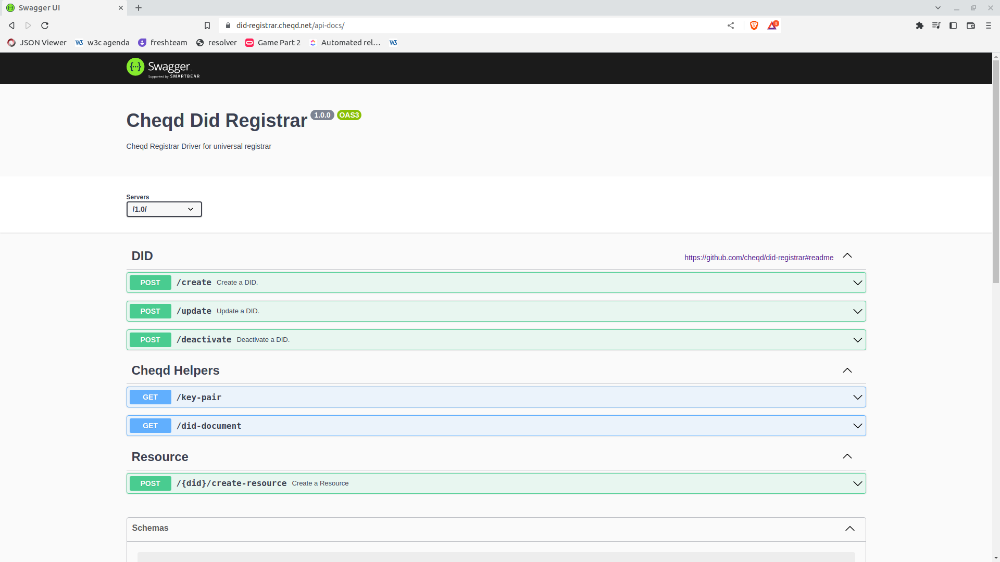
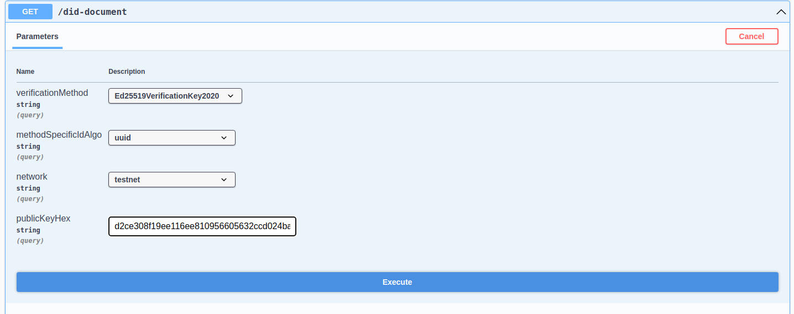

# Create a DID

## Summary

These instructions will help developers create DIDs on cheqd using the DID Registrar.

## Watch this video for a simple walkthrough



## What you need

1. Any framework for creating keys and signing payloads, such as [Veramo CLI](../../sdk/veramo/setup/);
2. cheqd [DID Registrar](https://did-registrar.cheqd.net/api-docs/)
3. 5 minutes!



_**Figure 1**:_ [_Swagger UI for DID Registrar_](https://did-registrar.cheqd.net/api-docs/)

## 1. Setup Veramo CLI

This tutorial will be using the Veramo CLI for Key management. Setup the cli following this [tutorial](../../sdk/veramo/setup/)

## 2. Generate Key Pair in Veramo wallet

Enter the below command in the cli

```bash
veramo execute -m keyManagerCreate --argsJSON '{ "type": "Ed25519", "kms": "local" }'
```

<details>

<summary>Example Output</summary>

```json
{
  "type": "Ed25519",
  "kid": "d2ce308f19ee116ee810956605632ccd024bad8dedd02baf49f248d03acdaa48",
  "publicKeyHex": "d2ce308f19ee116ee810956605632ccd024bad8dedd02baf49f248d03acdaa48",
  "meta": {
    "algorithms": [
      "Ed25519",
      "EdDSA"
    ]
  },
  "kms": "local"
}
```

Note down the `kid` and `publicKeyHex` values of the generated key

</details>

## 3. Generate DID Payload

Go to ["cheqd helpers" in our Registrar Driver here](https://did-registrar.cheqd.net/api-docs/#/Cheqd%20Helpers/get_did_document) and click "try it out" in the top right corner.

Select the following options:

* Select VerificationMethodType
* Select MethodSpecificAlgo
* Select network
* Enter the publicKeyHex value generated in the previous step



_**Figure 2**: Creating a DID payload from template_

<details>

<summary>Response</summary>

```json
{
  "didDoc": {
    "id": "did:cheqd:testnet:d4d4404b-6f7f-4e02-8d41-b81afb1f05ed",
    "controller": [
      "did:cheqd:testnet:d4d4404b-6f7f-4e02-8d41-b81afb1f05ed"
    ],
    "verificationMethod": [
      {
        "id": "did:cheqd:testnet:d4d4404b-6f7f-4e02-8d41-b81afb1f05ed#key-1",
        "type": "Ed25519VerificationKey2020",
        "controller": "did:cheqd:testnet:d4d4404b-6f7f-4e02-8d41-b81afb1f05ed",
        "publicKeyMultibase": "z6MkteA1x9gEkJbYTe8myArT39Q5gZBmLPqsqJLeM3htytCo"
      }
    ],
    "authentication": [
      "did:cheqd:testnet:d4d4404b-6f7f-4e02-8d41-b81afb1f05ed#key-1"
    ]
  },
  "key": {
    "verificationMethodId": "did:cheqd:testnet:d4d4404b-6f7f-4e02-8d41-b81afb1f05ed#key-1",
    "publicKeyHex": "d2ce308f19ee116ee810956605632ccd024bad8dedd02baf49f248d03acdaa48"
  }
}
```

</details>

Copy the `didDoc` field from the output.

## 4. Request Create Operation

Use `/create` to publish the DID

1. Paste the contents of `didDoc` from the previous step in the `didDocument` field of the `/create` api body
2.  Click on execute to perform the request

    This response requests an `action` for you to sign the serialized payload again in a CLI. This is a security feature which means you are not passing your private key to the Registrar. Note down the serialized payload, jobId from the response

## 5. Sign Payload

Sign the serialized payload in your CLI with the below command

```bash
veramo execute -m keyManagerSign
```

Fill in the prompts

1. keyRef: Enter the kid of the keyPair generated in the first step
2. algorithm: `Ed25519`
3. data to sign: Paste the serialized payload from the previous step
4. enconding: Select `base64`

<details>

<summary>Example Response</summary>

```jsonc
    Arguments:  {
    "keyRef": "d2ce308f19ee116ee810956605632ccd024bad8dedd02baf49f248d03acdaa48",
    "algorithm": "Ed25519",
    "data": "EjZkaWQ6Y2hlcWQ6dGVzdG5ldDpkNGQ0NDA0Yi02ZjdmLTRlMDItOGQ0MS1iODFhZmIxZjA1ZWQaNmRpZDpjaGVxZDp0ZXN0bmV0OmQ0ZDQ0MDRiLTZmN2YtNGUwMi04ZDQxLWI4MWFmYjFmMDVlZCLEAQo8ZGlkOmNoZXFkOnRlc3RuZXQ6ZDRkNDQwNGItNmY3Zi00ZTAyLThkNDEtYjgxYWZiMWYwNWVkI2tleS0xEhpFZDI1NTE5VmVyaWZpY2F0aW9uS2V5MjAyMBo2ZGlkOmNoZXFkOnRlc3RuZXQ6ZDRkNDQwNGItNmY3Zi00ZTAyLThkNDEtYjgxYWZiMWYwNWVkIjB6Nk1rdGVBMXg5Z0VrSmJZVGU4bXlBclQzOVE1Z1pCbUxQcXNxSkxlTTNodHl0Q28qPGRpZDpjaGVxZDp0ZXN0bmV0OmQ0ZDQ0MDRiLTZmN2YtNGUwMi04ZDQxLWI4MWFmYjFmMDVlZCNrZXktMWIkMjQ3MGZlOWEtMTQ3Ny00M2E0LTk1ZWYtZDg2ZTYxZTA1NWJi",
    "encoding": "base64"
    }

    Result : "1ubhK2CRWfB4AsqzsxVeoVwZ2yb7OpNMOe7assJXhnitoPkClm5ZFjT9zV7s6OETMKSVsUtFwIp4XCoj2xl4Bw"
```

</details>

**NOTE:** If there are _n_ verification methods for the controller then _n_ signatures are required to publish a DID.

Copy the Result value from the response.

## 6. Submit Signature

Use the `/create` api again

1. Create the payload using the following values
   * jobId
   * secret
     * signingResponse
       * verificationMethodId
       * signature
2. Click on Execute
3. The state in didState should be `finished` in the response, the DID is created successfully

## 7. Check your DID is live

You can check your DID on the universal resolver or by going to `https://resolver.cheqd.net/1.0/identifiers/{yourDID}`
