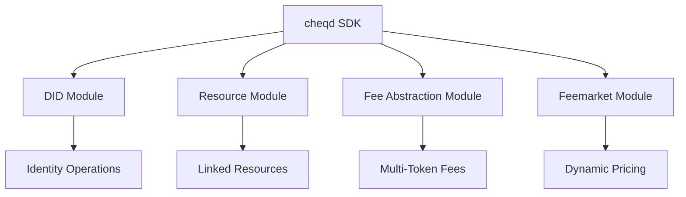

# Understanding the cheqd SDK

This guide provides a clear understanding of the cheqd SDK's architecture, modules, and practical use cases to help you choose the right tools for your decentralized identity solutions.

## SDK Architecture Overview

The cheqd SDK is built around four core modules that work together to provide comprehensive identity management and transaction processing capabilities:



## Module Overview & Use Cases

### 🆔 DID Module

**Purpose**: Complete lifecycle management for Decentralized Identifiers

**Key Features**:

- Create, update, and deactivate DIDs
- Support for multiple verification methods (Ed25519, secp256k1, RSA)
- Key rotation and authentication management
- Integration with fee abstraction and dynamic pricing

**When to Use**:

- Building identity wallets or credential platforms
- Creating enterprise identity systems
- Developing SSI (Self-Sovereign Identity) applications
- Managing organizational identities

**Practical Use Cases**:

- **Digital Identity Wallets**: Create DIDs for users with multiple authentication methods → [See DID Creation Guide](did-module/create-did.md)
- **Enterprise Identity**: Manage corporate identities with key rotation capabilities → [See DID Management](did-module/manage-did.md)
- **Multi-Signature Operations**: Set up DIDs with multiple controllers for organizational use → [See Multi-Controller Setup](did-module/README.md#multi-controller-operations)

### 📁 Resource Module

**Purpose**: Create and manage DID-Linked Resources (schemas, credential definitions, revocation lists)

**Key Features**:

- Store schemas, credential definitions, and revocation registries
- Version control and resource linking
- Flexible media type support (JSON, images, documents)
- Resource collection management

**When to Use**:

- Building credential issuance platforms
- Creating verifiable credential ecosystems
- Managing schema registries
- Storing credential-related metadata

**Practical Use Cases**:

- **Credential Schema Management**: Store and version credential schemas for issuers → [See Resource Creation](resource-module/README.md#credential-schemas)
- **Revocation Lists**: Manage credential revocation registries → [See Status Lists](resource-module/README.md#status-lists)
- **Trust Registry Data**: Store trusted issuer lists and governance documents → [See Trust Registries](resource-module/README.md#trust-registries)

### 💱 Fee Abstraction Module

**Purpose**: Pay transaction fees using alternative IBC tokens instead of native CHEQ

**Key Features**:

- Support for USDC, EURe, OSMO, and other IBC tokens
- Automatic rate conversion and fee calculation
- Cross-chain fee payment capabilities
- Integration with all identity operations

**When to Use**:

- Applications requiring stable fee costs
- Cross-chain identity solutions
- Enterprise applications with specific token preferences
- Users wanting to avoid native token volatility

**Practical Use Cases**:

- **Stablecoin Fee Strategy**: Pay fees in USDC for predictable costs → [See USDC Integration](fee-abstraction/using-in-transactions.md#usdc-payments)
- **Cross-Chain Applications**: Accept fees in tokens from connected Cosmos chains → [See IBC Token Usage](fee-abstraction/README.md#supported-tokens)
- **Enterprise Fee Management**: Use EUR-backed tokens for regulatory compliance → [See EURe Integration](fee-abstraction/using-in-transactions.md#eure-payments)

### 📈 Feemarket Module

**Purpose**: Dynamic fee calculation based on network congestion for Cosmos SDK transactions

**Key Features**:

- Real-time gas price adjustment
- Network congestion-based pricing
- Automatic fee optimization
- Standard Cosmos SDK transaction support

**When to Use**:

- Applications requiring cost optimization
- High-throughput transaction processing
- Standard Cosmos SDK operations (transfers, staking)
- Network efficiency optimization

**Practical Use Cases**:

- **Cost Optimization**: Automatically adjust fees based on network conditions → [See Dynamic Pricing](feemarket-module/dynamic-fees.md)
- **High-Volume Operations**: Process many transactions efficiently → [See Fee Optimization](feemarket-module/README.md#optimization-strategies)
- **Network Management**: Monitor and respond to congestion → [See Real-Time Pricing](feemarket-module/README.md#dynamic-pricing)

## Integration Patterns

### Module Combinations for Common Scenarios

#### 🏢 Enterprise Identity Platform

**Modules**: DID + Resource + Fee Abstraction
**Use Case**: Corporate identity management with stable costs

```typescript
// Create enterprise DID with USDC fees
const enterpriseDID = await didModule.createDidDocTx(signInputs, payload, feePayer, usdcFee);

// Store governance documents as resources
const governanceDoc = await resourceModule.createLinkedResourceTx(resourceInputs, payload, feePayer, usdcFee);
```

#### 🎓 Educational Credential System

**Modules**: DID + Resource + Fee Abstraction  
**Use Case**: University credential issuance with predictable fee costs

```typescript
// Create institution DID
const universityDID = await didModule.createDidDocTx(/* institution setup */);

// Create credential schema as resource
const degreeSchema = await resourceModule.createLinkedResourceTx(/* schema setup */);
```

#### 💳 High-Volume Transaction Processing

**Modules**: DID + Feemarket
**Use Case**: Efficient transaction processing with dynamic pricing

```typescript
// Get optimal gas price from feemarket
const gasPrice = await feemarketModule.getGasPrice();

// Process transactions with optimized fees
const result = await signer.signAndBroadcast(address, messages, gasPrice);
```

#### 🌐 Cross-Chain Identity Bridge

**Modules**: All Modules
**Use Case**: Multi-chain identity with flexible fee payment

```typescript
// Support both fee abstraction and dynamic pricing
const feeStrategy = networkCongestion > threshold ? 
  await feemarketModule.calculateOptimalFee() : 
  await feeAbstractionModule.convertToPreferredToken(baseFee);
```

## Advanced Capabilities

### 🔧 Gas Simulation & Transaction Optimization

For production applications requiring precise cost control and reliable execution:

**Key Features**:

- Pre-transaction gas estimation
- Smart transaction batching
- Built-in retry mechanisms with exponential backoff
- Circuit breaker patterns for resilience

**When to Use**:

- Production applications with SLA requirements
- High-value transactions requiring certainty
- Batch processing operations
- Cost-sensitive applications

**Learn More**: [Gas Simulation & Optimization Guide](simulation-gas-optimization.md)

## Quick Decision Matrix

Use this matrix to quickly identify which modules you need:

| Your Requirement | Recommended Modules | Key Use Cases |
|------------------|---------------------|---------------|
| **Basic Identity Management** | DID Module | User accounts, authentication |
| **Credential Issuance** | DID + Resource | Schemas, credential definitions |
| **Stable Fee Costs** | Any Module + Fee Abstraction | Enterprise apps, predictable budgets |
| **Cost Optimization** | Any Module + Feemarket | High-volume apps, efficiency focus |
| **Cross-Chain Identity** | DID + Resource + Fee Abstraction | Multi-chain applications |
| **Production Reliability** | All Modules + Gas Simulation | Mission-critical applications |

## Getting Started

1. **Start Here**: [SDK Setup Guide](sdk-setup.md) - Install and configure the SDK
2. **Choose Your Path**:
   - **Identity First**: Begin with [DID Module](did-module/)
   - **Cost Control**: Start with [Fee Abstraction](fee-abstraction/)
   - **Optimization**: Explore [Gas Simulation](simulation-gas-optimization.md)
3. **Advanced Integration**: Combine modules based on your specific requirements

## Module Documentation

- **[DID Module](did-module/README.md)** - Complete DID lifecycle management
- **[Resource Module](resource-module/README.md)** - DID-Linked Resource operations
- **[Fee Abstraction Module](fee-abstraction/README.md)** - Multi-token fee payments
- **[Feemarket Module](feemarket-module/README.md)** - Dynamic fee optimization
- **[Gas Simulation Guide](simulation-gas-optimization.md)** - Advanced transaction optimization

Each module includes comprehensive examples, error handling patterns, and production best practices to help you build robust decentralized identity solutions.
