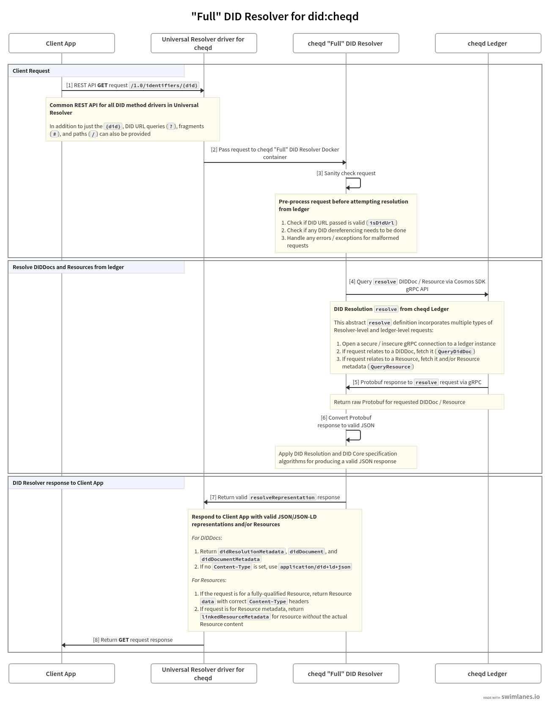
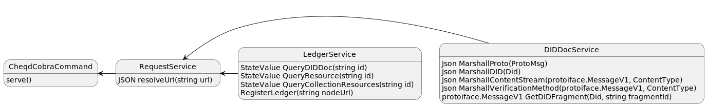
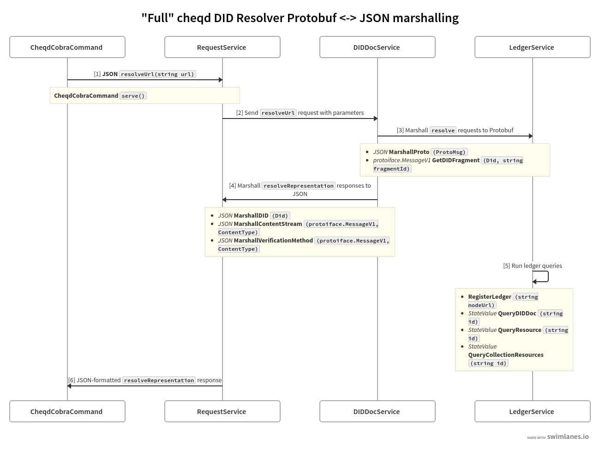

# ADR 001: cheqd DID Resolver

## Status

| Category                  | Status                                        |
| :------------------------ | :-------------------------------------------- |
| **Authors**               | Alex Tweeddale, Ankur Banerjee, Renata Toktar |
| **ADR Stage**             | ACCEPTED                                         |
| **Implementation Status** | Implemented           |
| **Start Date**            | 2022-02-22                                    |
| **Last Updated**          | 2022-08-04                                    |

## Summary

The [`did:cheqd` method ADR](https://docs.cheqd.io/node/architecture/adr-list/adr-002-cheqd-did-method) defines how DIDs are created and read from ledger. According to the [W3C DID Core specification](https://w3c.github.io/did-core/), DID methods are expected to provide [standards-compliant methods of DID and DID Document ("DIDDoc") production](https://w3c.github.io/did-core/#production-and-consumption).

The [cheqd DID Resolver](https://github.com/cheqd/did-resolver) is designed to implement the [W3C DID _Resolution_ specification](https://w3c-ccg.github.io/did-resolution/) for [`did:cheqd`](https://docs.cheqd.io/node/architecture/adr-list/adr-002-cheqd-did-method) method.

## Context

The DID Resolution specification prescribes [a defined algorithm with standardised behaviour for expected and unexpected inputs](https://w3c-ccg.github.io/did-resolution/#resolving-algorithm) that a conforming DID method must be able to produce.

All conforming DID resolvers implement `resolve` and `resolveRepresentation` abstract functions, as defined in the [DID Resolution specification](https://w3c-ccg.github.io/did-resolution/#resolving).

### Resolve function

The `resolve` function is intended to fetch the _abstract_ form of the DID Document, as stored on the ledger. This abstract/raw form [may _not_ necessarily be in JSON/JSON-LD format](https://www.w3.org/TR/did-core/#did-resolution) as the underlying data persistence layer where the DIDDoc is stored for any particular method might use different serialisation/storage formats.

```js
resolve(did, resolutionOptions) →
« didResolutionMetadata, didDocument, didDocumentMetadata »
```

Since [cheqd uses the Cosmos SDK blockchain framework](https://blog.cheqd.io/why-cheqd-has-joined-the-cosmos-4db8845722c5), the underlying data storage and retrieval ("resolve") mechanisms used rely on those offered by the [Cosmos SDK framework](https://docs.cosmos.network/main/intro/overview.html). Cosmos SDK [uses Protobuf (Protocol Buffers) encoding for its wire protocol](https://docs.cosmos.network/main/core/encoding.html).

Cosmos SDK framework typically provides [gRPC/gRPC-Web, JSON-RPC, and REST API endpoints for on-ledger modules](https://docs.cosmos.network/main/core/grpc_rest.html) and functionality.

For example, `did:cheqd:testnet:DAzMQo4MDMxCjgwM` can be fetched using the native Cosmos SDK REST API endpoint (or equivalent endpoints). This provides responses that would meet the abstract definition of a `resolve` function as defined in the DID Core specification.

In case of the cheqd network _testnet_, an instance of this `resolve` endpoint through the Cosmos SDK REST API would be [api.cheqd.network/cheqd/v1/did/did:cheqd:testnet:DAzMQo4MDMxCjgwM](https://api.cheqd.network/cheqd/v1/did/did:cheqd:testnet:DAzMQo4MDMxCjgwM) which returns the following response:

```json
{
  "did": {
    "context": [],
    "id": "did:cheqd:testnet:DAzMQo4MDMxCjgwM",
    "controller": [],
    "verification_method": [
      {
        "id": "did:cheqd:testnet:DAzMQo4MDMxCjgwM#key1",
        "type": "Ed25519VerificationKey2020",
        "controller": "did:cheqd:testnet:DAzMQo4MDMxCjgwM",
        "public_key_jwk": [],
        "public_key_multibase": "z6jVkB274neVf7iJETpMECwznBF8wDe8tpvF4BZLRZgMU"
      }
    ],
    "authentication": ["did:cheqd:testnet:DAzMQo4MDMxCjgwM#key1"],
    "assertion_method": [],
    "capability_invocation": [],
    "capability_delegation": [],
    "key_agreement": [],
    "service": [],
    "also_known_as": []
  },
  "metadata": {
    "created": "2022-07-19T08:29:07Z",
    "updated": "",
    "deactivated": false,
    "version_id": "57543FA1D9C56033BABBFA3A438E0A149E01BBB89E6D666ACE1243455AA6F2BC",
    "resources": ["44547089-170b-4f5a-bcbc-06e46e0089e4"]
  }
}
```

As you can see in the response body above, this is the raw Protobuf fetched from the cheqd testnet ledger, marshalled into a JSON form. Crucially, this form has certain deviations from the JSON/JSON-LD production expected in DID Core specification:

1. JSON key names that correlate to DID Core properties are listed in [`snake_case`](https://en.wikipedia.org/wiki/Snake_case), rather than [`camelCase`](https://en.wikipedia.org/wiki/Camel_case) as required. This is because Protobuf standard linting rules require these properties to be defined in `snake_case`.
2. DID Core properties with empty values are still shown in this JSON, whereas the requirement is to drop them from standards-compliant DIDDoc representations.

### Resolve Representation function

The `resolveRepresentation` abstract function, as defined in DID Core specification, is intended to address concerns similar to the ones highlighted above to product a [standards-compliant JSON/JSON-LD representation](https://www.w3.org/TR/did-core/#did-resolution) of a DIDDoc.

```js
resolveRepresentation(did, resolutionOptions) →
« didResolutionMetadata, didDocumentStream, didDocumentMetadata »
```

For example, a `resolveRepresentation` function _could_ derive a valid standards-compliant representation of `did:cheqd:testnet:DAzMQo4MDMxCjgwM` from the above `resolve` function. The response would be similar to the one below containing Resolution Metadata, DIDDoc, and DIDDoc Metadata:

```json
{
  "didResolutionMetadata": {
    "contentType": "application/did+ld+json",
    "retrieved": "2022-08-03T09:52:49Z",
    "did": {
      "didString": "did:cheqd:testnet:DAzMQo4MDMxCjgwM",
      "methodSpecificId": "DAzMQo4MDMxCjgwM",
      "method": "cheqd"
    }
  },
  "didDocument": {
    "id": "did:cheqd:testnet:DAzMQo4MDMxCjgwM",
    "verificationMethod": [
      {
        "id": "did:cheqd:testnet:DAzMQo4MDMxCjgwM#key1",
        "type": "Ed25519VerificationKey2020",
        "controller": "did:cheqd:testnet:DAzMQo4MDMxCjgwM",
        "publicKeyMultibase": "z6jVkB274neVf7iJETpMECwznBF8wDe8tpvF4BZLRZgMU"
      }
    ],
    "authentication": ["did:cheqd:testnet:DAzMQo4MDMxCjgwM#key1"]
  },
  "didDocumentMetadata": {
    "created": "2022-07-19T08:29:07Z",
    "versionId": "57543FA1D9C56033BABBFA3A438E0A149E01BBB89E6D666ACE1243455AA6F2BC",
    "linkedResourceMetadata": [
      {
        "resourceURI": "did:cheqd:testnet:DAzMQo4MDMxCjgwM/resources/44547089-170b-4f5a-bcbc-06e46e0089e4",
        "resourceCollectionId": "DAzMQo4MDMxCjgwM",
        "resourceId": "44547089-170b-4f5a-bcbc-06e46e0089e4",
        "resourceName": "DemoResource",
        "resourceType": "CL-Schema",
        "mediaType": "application/json",
        "created": "2022-07-19T08:40:00Z",
        "checksum": "7b2022636f6e74656e74223a202274657374206461746122207d0ae3b0c44298",
        "previousVersionId": null, // null if no previous version, otherwise, resourceId of previous version
        "nextVersionId": null // null if no new version, otherwise, resourceId of new version
      }
    ]
  }
}
```

## Architecture of DID Resolver for cheqd

As described above, the abstract `resolve` function is already available for the cheqd ledger via the default Cosmos SDK gRPC/REST API endpoints. Our primary objective with building a DID Resolver for cheqd was to design this `resolveRepresentation` piece as a standalone component that was _not_ packaged within the [cheqd-node ledger code](https://github.com/cheqd/cheqd-node).

This objective has certain advantages:

- Updates to DID Resolver code can be carried out and released independently of cheqd-node releases. As a consequence, there's no need to go through an on-ledger governance vote, and voting period to make a change to `resolveRepresentation`.
- A separate web service module would allow for flexibility in how to handle complex scenarios on DID URL Dereferencing, error code handling for DID URL requests, and safely handling content transport for various media types.
- Making the DID Resolver a standalone, non-ledger module allows for an operator of this web service to _independently_ scale their service horizontally and vertically.

We explored two architectural patterns for how a DID Resolver could be implemented for the cheqd ledger. The objective here was to explore and provide DID resolution operators multiple approaches for running resolution service, each with their own pros and cons (which are discussed below).

1. **"Full" cheqd DID Resolver**
   1. Since the [cheqd-node ledger](https://github.com/cheqd/cheqd-node) / Cosmos SDK is written in Golang, this resolver would consist of Golang libraries imported from the existing ledger code. This promotes code reuse.
   2. Data would be fetched from the ledger using the gRPC endpoint on a node, which allows it (by default) to take place over an encrypted channel [since gRPC uses HTTP/2](https://grpc.io/).
   3. Data retrieved would be in the native Protobuf representation as stored on ledger, thus allowing data integrity computations to be made.
2. **"Light" cheqd DID Resolver**
   1. Universal Resolver drivers are designed to be run as Docker containers. A limitation of this approach is that the computation footprint of a compute resource can be quite high, e.g., a Docker container may be 100 MB+ in size and [suffer from slow startup times in a "cold-start" scenario](https://mikhail.io/serverless/coldstarts/aws/).
   2. Thus, our "Light" DID Resolver idea was to explore using [Cloudflare Workers](https://workers.cloudflare.com/), a lightweight serverless compute platform. As a comparison, [Cloudflare Workers are limited to 1 MB in size](https://developers.cloudflare.com/workers/platform/limits/) and [have extremely low cold-start times](https://blog.cloudflare.com/eliminating-cold-starts-with-cloudflare-workers/). (We use Cloudflare Workers in [our Cosmos SDK Custom Data API](https://github.com/cheqd/data-api), for example.)
   3. Cloudflare Workers can also be deployed outside the Cloudflare service in a Docker container using [Miniflare](https://miniflare.dev/). This could be used to provide a Docker container deployment option for the Universal Resolver `did:cheqd` driver.
   4. However, [a limitation of Cloudflare Workers is they do not allow a gRPC _request_ to be made](https://community.cloudflare.com/t/can-i-make-a-grpc-request-from-a-worker/157450/4) to an external endpoint. This would force the "Light" cheqd Resolver to use the gRPC-Web / REST endpoint `resolve` implementation to fetch data from the ledger. This could be considered a higher risk profile in terms of data integrity by resolver operators / client applications.

Both of the architectural patterns above are designed so that a **[Universal Resolver driver for `did:cheqd`](https://github.com/decentralized-identity/universal-resolver)** could be created. The Universal Resolver project aims to provide a common REST API definition for DID Resolution where each DID method can provide a Docker container that with an easy-to-deploy mechanism for the specific DID method.

### _Full_ cheqd DID Resolver

The _Full cheqd DID Resolver_ is able to use `github.com/cheqd/cheqd-node` as a Golang module for send `resolve` requests to a cheqd node instance to fetch DIDDoc / Resources from the ledger.

Since the _Full cheqd DID Resolver_ is wrapped for usage as a Docker container image using the Universal Resolver specification, the end-to-end sequence diagram for our DID Resolver would look like below:



_Figure 1:_ "Full" cheqd DID Resolver sequence diagram ([editable version](https://swimlanes.io/u/CE_Rjphs9?rev=7))

The _Full cheqd DID Resolver_ is designed to handle requests concurrently, while reducing the risk of large quantities of threads and requests blocking the efficiency of the on-ledger services.

#### Fetching Protobuf from ledger and converting it to JSON

Since Cosmos SDK SDK encodes data in Protobuf, the DID Resolver "[marshalls](<https://en.wikipedia.org/wiki/Marshalling_(computer_science)>)" them to JSON. The software class diagram below describes how these components/methods are tied together:



_Figure 2:_ "Full" cheqd DID Resolver class diagram

Marshalling/unmarshalling requests back-and-forth between Protobuf and JSON is carried out by services in the "Full" DID Resolver



_Figure 3:_ "Full" cheqd DID Resolver Protobuf <-> JSON marshalling ([editable version](https://swimlanes.io/u/2W1PQKx_s?rev=4))

### DID URL Resolution / Dereferencing rules

The cheqd DID Resolver complies with the rules and algorithm defined in [Decentralized Identifier Resolution (DID Resolution) v0.2](https://w3c-ccg.github.io/did-resolution). This section clarifies and expands some descriptions specific to cheqd.

The [DID Resolution specification HTTP(S) bindings](https://w3c-ccg.github.io/did-resolution/#bindings-https) section states that:

> If the output of the DID URL dereferencing function contains the `didDocumentStream`:
>
> - If the value of the `Accept` HTTP header is absent or `application/did+ld+json` (or other media type of a conformant representation of a DID document):
>   - The HTTP response status code MUST be `200`.
>   - The HTTP response MUST contain a `Content-Type` header. The value of this header MUST be `application/did+ld+json` (or other media type of a conformant representation of a DID document).
> - The HTTP response body MUST contain the `didDocumentStream`, in the representation corresponding to the `Accept` HTTP header.

Since the cheqd DID Resolver APIs are REST APIs, the default `Content-Type: application/did+ld+json` encoding is used if the `Accept` header is not explicitly set since it matches the `Accept: */*` header that most client applications send.

#### `Accept` header is `application/did+ld+json` OR blank OR `*/*`

- **Response** HTTP headers
  - Status code `200 OK`
  - `Content-Type: application/did+ld+json`
- **Response** HTTP body
  - `didDocument` / `contentStream` contains `@context` section;
  - `didResolutionMetadata` / `dereferencingMetadata` `contentType` field is `application/did+ld+json`

#### `Accept` request HTTP header contains `application/ld+json;profile="https://w3id.org/did-resolution"`

- **Response** HTTP headers
  - Status code `200 OK`
  - `Content-Type: application/ld+json;profile="https://w3id.org/did-resolution`
- **Response** HTTP body
  - `didDocument` / `contentStream` contains `@context` section;
  - `didResolutionMetadata` / `dereferencingMetadata` `contentType` field is `application/ld+json;profile="https://w3id.org/did-resolution`

#### `Accept` request HTTP header contains `application/did+json`

- **Response** HTTP headers
  - Status code `200 OK`
  - `Content-Type: application/did+json`
- **Response HTTP body**
  - `didDocument` / `contentStream` DOES NOT contain `@context` section;
  - `didResolutionMetadata` / `dereferencingMetadata` `ContentType` field is `application/did+json`

### On-ledger Resource resolution rules

Requests to fetch on-ledger cheqd Resources are considered as a DID URL Dereferencing scenario it uses [DID URL paths](https://w3c.github.io/did-core/#path) to lead to a Resource object, rather than a DIDDoc.

On the other hand, on-ledger cheqd Resources _metadata_ requests are handled like DID URL Resolution since the result is a subsection of `didDocumentMetadata` specific to that resource.

API endpoints related to on-ledger cheqd Resources are described below. All of these request _types_ are `GET` requests, with `POST` and `PUT` requests disallowed.

#### Get a specific Resource

Returns the Resource data/payload stored on ledger for specified resource. `HEAD` request _type_ is also allowed for this endpoint since it can be used for [HTTP content negotiation](https://developer.mozilla.org/en-US/docs/Web/HTTP/Content_negotiation) phase by client applications. In this case, _only_ the HTTP **Response** headers are returned without the body.

**Endpoint**: `/1.0/identifiers/<did>/resources/<resource_id>`

1. **Request** HTTP headers
   1. `Accept` should allow `*/*` _or_ match the `mediaType` of the Resource
   2. [`Accept-Encoding`](https://developer.mozilla.org/en-US/docs/Web/HTTP/Headers/Accept-Encoding) may be allowed compression methods (e.g., `gzip`, `compress`, etc.)
2. **Response** HTTP headers
   1. Status code `200 OK`
   2. `Content-Type` should be set to `mediaType>` of the Resource
   3. `Content-Encoding` should be set to a valid content compression method in `Accept-Encoding` and response compressed accordingly
   4. [`Content-Length`](https://developer.mozilla.org/en-US/docs/Web/HTTP/Headers/Content-Length) should be set to the Resource size, in decimal bytes
3. **Response** HTTP body
   1. Resource, encoded correctly according to the `mediaType`

#### Get _metadata_ for a specific resource

Return metadata for a specified resource. This is effectively a portion of the DIDDoc Metadata block.

**Endpoint**: `/1.0/identifiers/<did>/resources/<resource_id>/metadata`

#### Get metadata for _all_ Resources linked to a DID

Returns metadata for all Resources directly linked to/controlled by a DID. This is effectively the full `linkedResourceMetadata` section in DIDDoc Metadata block.

**Endpoint**: `/1.0/identifiers/<did>/resources/all`

##### Alternative endpoints

1. `/1.0/identifiers/<did>/resources/`
   1. Status code `301`
   2. Redirect to `/resources/all`
2. `/1.0/identifiers/<did>/resources`
   1. Throw an `invalidDidUrl` error

### Error handling

The DID Resolution specification [defines an algorithm for how invalid DID URL Resolution/Dereferencing errors](https://w3c-ccg.github.io/did-resolution/#resolving-algorithm) should be handled. The cheqd DID Resolver aims to implement all of these scenarios, with the [correct HTTP Response status codes based on the specific error](https://w3c-ccg.github.io/did-resolution/#bindings) encountered.

#### DID Resolution errors

The DID resolution output should always conform to the following format: `( didResolutionMetadata, didDocument, didDocumentMetadata )`

If the resolution is unsuccessful, the DID resolver should return the following result:

- `didResolutionMetadata` contains `"error" : "<Error message>"`
- `didDocument`: null
- `didDocumentMetadata`: `[]`

#### DID URL Dereferencing errors

The DID dereferencing output should always conform to the following format: `( dereferencingMetadata, contentStream, contentMetadata )`

- `dereferencingMetadata` contains `"error" : "<Error message>"`
- `contentStream`: null
- `contentMetadata`: `[]`

## Decision

Given the drawbacks associated with a _Light cheqd DID Resolver_ being unable to send gRPC requests to a cheqd node instance, the decision was taken to (initially) implement the _Full cheqd DID Resolver_ architecture. Future work might separately consider and design a _Light_ DID Resolver profile that can work with Cloudflare Workers while also allowing deployment through Docker.

### Universal Resolver driver for `did:cheqd`

Compiled packages/binaries for the _Full cheqd DID Resolver_ will be made available as a Docker container image with standardised Docker Compose configuration as defined in the [Universal Resolver driver development guide](https://github.com/decentralized-identity/universal-resolver/blob/main/docs/driver-development.md) to provide an easy mechanism for DID Resolution operators to incorporate `did:cheqd` as one of the supported DID methods they handle.

### Configuration properties for Universal Resolver driver

1. Operators should be able to configure gRPC endpoints for mainnet as as testnet (or any other cheqd network namespaces) so that a single DID Resolver instance can resolve requests to any network. (E.g., `grpc.cheqd.net`for mainnet, `grpc.cheqd.network` for testnet)
2. For each supported cheqd network namespace (e.g., mainnet, testnet), operators should be able to define _one_ or more upstream cheqd node gRPC endpoints. (E.g., additional fallback endpoints besides `grpc.cheqd.net` for mainnet.) In case any one of the upstream endpoints is unavailable, this allows the DID Resolver to try a different upstream gRPC endpoint for resiliency.
3. Operators should be able to define whether their gRPC pull/request is **secure** (default, carried out over HTTP.2 with TLS handshake) or **insecure** (optional, equivalent to a `grpcurl -plaintext` connection downgrade). This accommodates scenarios where gRPC endpoints may not necessarily be equipped to handle TLS handshakes, since the default Cosmos SDK / cheqd node configuration endpoints do not have TLS certificates defined.

## Consequences

### Backwards Compatibility

1. Not applicable, since this would be the first release of cheqd DID Resolver

### Positive

1. _Full cheqd DID Resolver_ reuses existing code to handle some parts of resolve and representing DIDDocs.
2. Third-party applications that want to implement their own DID Resolver implementations for cheqd can consume the current implementation as a Golang module (e.g., `import "github.com/cheqd/cheqd-did-resolver/services"`).
3. Universal Resolver driver implementation provides a standardised way of incorporating `did:cheqd` into Universal Resolver instances that support multiple DID methods.

### Negative

1. Use of a custom DID URL path (e.g., `/1.0/identifiers/{did}/resources/{resource-id}` can be non-standard). Efforts should be made to see if this can implemented instead using DID URL _queries_ according to the [Trust over IP Foundation "DID URL Resource Parameter" specification](https://wiki.trustoverip.org/display/HOME/DID+URL+Resource+Parameter+Specification).

### Neutral

1. Lack of a _Light cheqd DID Resolver_, at least initially, might not give an easy and computationally-cheap alternative to running Docker containers.

## References

- [W3C Decentralized Identifiers (DIDs)](https://www.w3.org/TR/did-core/) recommendation
- [W3C Decentralized Identifier Resolution (DID Resolution)](https://w3c-ccg.github.io/did-resolution/) specification
- [Universal Resolver driver development](https://github.com/decentralized-identity/universal-resolver/blob/main/docs/driver-development.md) guide
- [DID Core Specification Test Suite](https://w3c.github.io/did-test-suite/)
