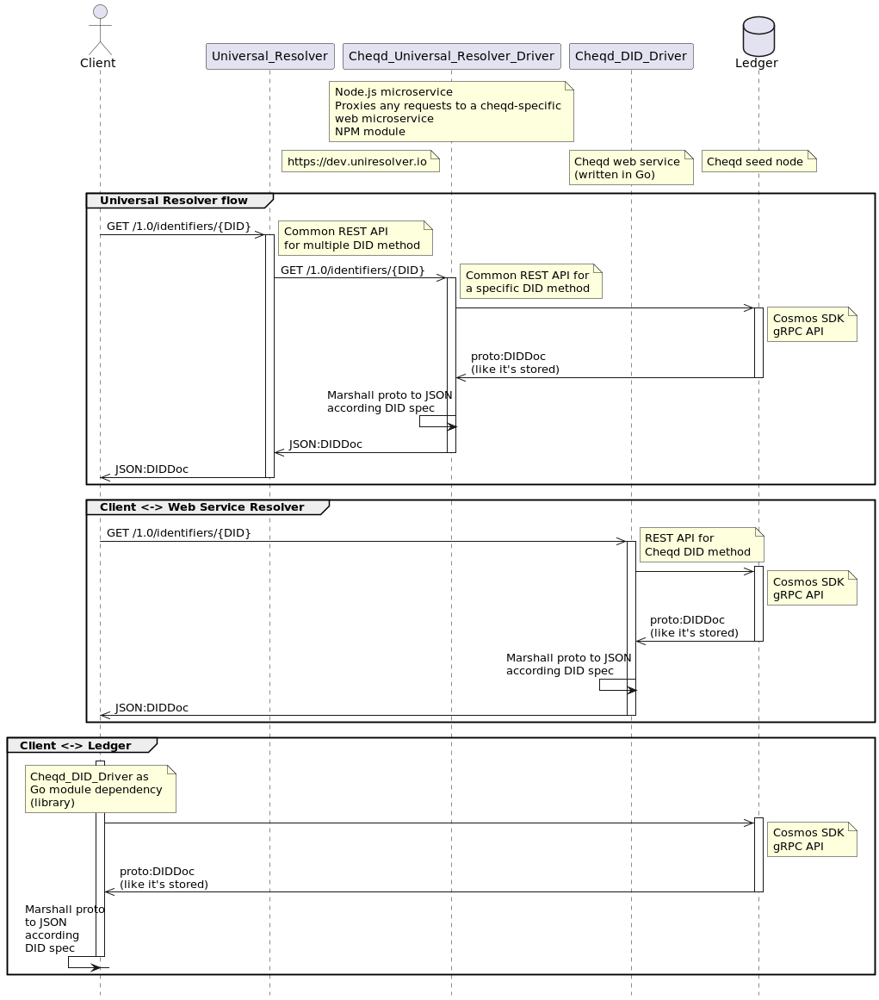

# ADR 001: DID Resolver

## Status

| Category | Status |
| :--- | :--- |
| **Authors** | Alex Tweeddale, Renata Toktar, Ankur Banerjee |
| **ADR Stage** | DRAFT |
| **Implementation Status** | In Progress |
| **Start Date** | 2022-02-22 |
| **Last Updated** | 2022-08-04 |

## Summary

The [`did:cheqd` method ADR](https://docs.cheqd.io/node/architecture/adr-list/adr-002-cheqd-did-method) defines how DIDs are created and read from ledger. According to the [W3C DID Core specification](https://w3c.github.io/did-core/), DID methods are expected to provide [standards-compliant methods of DID and DID Document ("DIDDoc") production](https://w3c.github.io/did-core/#production-and-consumption).

The [cheqd DID Resolver](https://github.com/cheqd/did-resolver) is designed to implement the [W3C DID *Resolution* specification](https://w3c-ccg.github.io/did-resolution/) for [`did:cheqd`](https://docs.cheqd.io/node/architecture/adr-list/adr-002-cheqd-did-method) method.

## Context

The DID Resolution specification prescribes [a defined algorithm with standardised behaviour for expected and unexpected inputs](https://w3c-ccg.github.io/did-resolution/#resolving-algorithm) that a conforming DID method must be able to produce.

All conforming DID resolvers implement `resolve` and `resolveRepresentation` abstract functions, as defined in the [DID Resolution specification](https://w3c-ccg.github.io/did-resolution/#resolving).

### Resolve function

The `resolve` function is intended to fetch the *abstract* form of the DID Document, as stored on the ledger. This abstract/raw form [may *not* necessarily be in JSON/JSON-LD format](https://www.w3.org/TR/did-core/#did-resolution) as the underlying data persistence layer where the DIDDoc is stored for any particular method might use different serialisation/storage formats.

```js
resolve(did, resolutionOptions) → 
« didResolutionMetadata, didDocument, didDocumentMetadata »
```

Since [cheqd uses the Cosmos SDK blockchain framework](https://blog.cheqd.io/why-cheqd-has-joined-the-cosmos-4db8845722c5), the underlying data storage and retrieval ("resolve") mechanisms used rely on those offered by the [Cosmos SDK framework](https://docs.cosmos.network/master/intro/overview.html). Cosmos SDK [uses Protobuf (Protocol Buffers) encoding for its wire protocol](https://docs.cosmos.network/master/core/encoding.html).

Cosmos SDK framework typically provides [gRPC/gRPC-Web, JSON-RPC, and REST API endpoints for on-ledger modules](https://docs.cosmos.network/master/core/grpc_rest.html) and functionality.

For example, `did:cheqd:testnet:DAzMQo4MDMxCjgwM` can be fetched using the native Cosmos SDK REST API endpoint (or equivalent endpoints). This provides responses that would meet the abstract definition of a `resolve` function as defined in the DID Core specification.

In case of the cheqd network *testnet*, an instance of this `resolve` endpoint through the Cosmos SDK REST API would be [api.cheqd.network/cheqd/v1/did/did:cheqd:testnet:DAzMQo4MDMxCjgwM](https://api.cheqd.network/cheqd/v1/did/did:cheqd:testnet:DAzMQo4MDMxCjgwM) which returns the following response:

```jsonc
{
  "did": {
    "context": [
    ],
    "id": "did:cheqd:testnet:DAzMQo4MDMxCjgwM",
    "controller": [
    ],
    "verification_method": [
      {
        "id": "did:cheqd:testnet:DAzMQo4MDMxCjgwM#key1",
        "type": "Ed25519VerificationKey2020",
        "controller": "did:cheqd:testnet:DAzMQo4MDMxCjgwM",
        "public_key_jwk": [
        ],
        "public_key_multibase": "z6jVkB274neVf7iJETpMECwznBF8wDe8tpvF4BZLRZgMU"
      }
    ],
    "authentication": [
      "did:cheqd:testnet:DAzMQo4MDMxCjgwM#key1"
    ],
    "assertion_method": [
    ],
    "capability_invocation": [
    ],
    "capability_delegation": [
    ],
    "key_agreement": [
    ],
    "service": [
    ],
    "also_known_as": [
    ]
  },
  "metadata": {
    "created": "2022-07-19T08:29:07Z",
    "updated": "",
    "deactivated": false,
    "version_id": "57543FA1D9C56033BABBFA3A438E0A149E01BBB89E6D666ACE1243455AA6F2BC",
    "resources": [
      "44547089-170b-4f5a-bcbc-06e46e0089e4"
    ]
  }
}
```

As you can see in the response body above, this is the raw Protobuf fetched from the cheqd testnet ledger, marshalled into a JSON form. Crucially, this form has certain deviations from the JSON/JSON-LD production expected in DID Core specification:

1. JSON key names that correlate to DID Core properties are listed in [`snake_case`](https://en.wikipedia.org/wiki/Snake_case), rather than [`camelCase`](https://en.wikipedia.org/wiki/Camel_case) as required. This is because Protobuf standard linting rules require these properties to be defined in `snake_case`.
2. DID Core properties with empty values are still shown in this JSON, whereas the requirement is to drop them from standards-compliant DIDDoc representations.

### Resolve Representation function

The `resolveRepresentation` abstract function, as defined in DID Core specification, is intended to address concerns similar to the ones highlighted above to product a [standards-compliant JSON/JSON-LD representation](https://www.w3.org/TR/did-core/#did-resolution) of a DIDDoc.

```js
resolveRepresentation(did, resolutionOptions) → 
« didResolutionMetadata, didDocumentStream, didDocumentMetadata »
```

For example, a `resolveRepresentation` function *could* derive a valid standards-compliant representation of `did:cheqd:testnet:DAzMQo4MDMxCjgwM` from the above `resolve` function. The response would be similar to the one below containing Resolution Metadata, DIDDoc, and DIDDoc Metadata:

```jsonc
{
  "didResolutionMetadata": {
    "contentType": "application/did+ld+json",
    "retrieved": "2022-08-03T09:52:49Z",
    "did": {
      "didString": "did:cheqd:testnet:DAzMQo4MDMxCjgwM",
      "methodSpecificId": "DAzMQo4MDMxCjgwM",
      "method": "cheqd"
    }
  },
  "didDocument": {
    "id": "did:cheqd:testnet:DAzMQo4MDMxCjgwM",
    "verificationMethod": [
      {
        "id": "did:cheqd:testnet:DAzMQo4MDMxCjgwM#key1",
        "type": "Ed25519VerificationKey2020",
        "controller": "did:cheqd:testnet:DAzMQo4MDMxCjgwM",
        "publicKeyMultibase": "z6jVkB274neVf7iJETpMECwznBF8wDe8tpvF4BZLRZgMU"
      }
    ],
    "authentication": [
      "did:cheqd:testnet:DAzMQo4MDMxCjgwM#key1"
    ]
  },
  "didDocumentMetadata": {
    "created": "2022-07-19T08:29:07Z",
    "versionId": "57543FA1D9C56033BABBFA3A438E0A149E01BBB89E6D666ACE1243455AA6F2BC",
    "linkedResources": [
      {
        "resourceURI": "did:cheqd:testnet:DAzMQo4MDMxCjgwM/resources/44547089-170b-4f5a-bcbc-06e46e0089e4",
        "resourceCollectionId": "DAzMQo4MDMxCjgwM",
        "resourceId": "44547089-170b-4f5a-bcbc-06e46e0089e4",
        "resourceName": "DemoResource",
        "resourceType": "CL-Schema",
        "mediaType": "application/json",
        "created": "2022-07-19T08:40:00Z",
        "checksum": "7b2022636f6e74656e74223a202274657374206461746122207d0ae3b0c44298",
        "previousVersionId": null, // null if no previous version, otherwise, resourceId of previous version
        "nextVersionId": null, // null if no new version, otherwise, resourceId of new version
      }
    ]
  }
}
```

## Architecture of DID Resolver for cheqd

As described above, the abstract `resolve` function is already available for the cheqd ledger via the default Cosmos SDK gRPC/REST API endpoints. Our primary objective with building a DID Resolver for cheqd was to design this `resolveRepresentation` piece as a standalone component that was *not* packaged within the [cheqd-node ledger code](https://github.com/cheqd/cheqd-node).

This objective has certain advantages:

1. Updates to DID Resolver code can be carried out and released independently of cheqd-node releases. As a consequence, there's no need to go through an on-ledger governance vote, and voting period to make a change to `resolveRepresentation`.
2. A separate web service module would allow for flexibility in how to handle complex scenarios on DID URL Dereferencing, error code handling for DID URL requests, and safely handling content transport for various media types.
3. In addition, the separation of the system into microservices provides more flexibility to third parties in how they choose to resolve cheqd DIDs.


When exploring the We decided to design multiple implementations of the cheqd DID Resolver to suit different clients and audiences, which may want to consume cheqd DIDs for different purposes.

Importantly, each implementation of the cheqd DID Resolver is decoupled from the cheqd network, which means updating the resolver does not require updating the application on the node side. This avoids having to go through an on-ledger governance vote, and voting period to make a change. In addition, the separation of the system into microservices provides more flexibility to third parties in how they choose to resolve cheqd DIDs.

- A **full cheqd DID Resolver** to generate a spec compliant DIDDoc, based on the [cheqd DID method](https://github.com/cheqd/node-docs/blob/main/architecture/adr-list/adr-002-cheqd-did-method.md), through communicating with a cheqd node at the gPRC endpoint. This can be implemented as:
  - A **library written in Go** which can be imported directly into client applications, or
  - A **standalone web service**, which acts as a proxy to forward requests to the cheqd node.
- A **light cheqd DID Resolver**, run on [Cloudflare Workers](https://workers.cloudflare.com/), presenting a highly accessible and easily deployable instance of the cheqd DID Resolver, with a lower computational footprint than the full cheqd DID Resolver;
- A **[Universal Resolver Driver](https://github.com/decentralized-identity/universal-resolver)** packaged using [Docker Containers](https://www.docker.com/resources/what-container/), presenting a readily consumable, lightweight and secure instance of either the **full** cheqd DID Resolver or the **light** cheqd DID Resolver.

## Overall architecture diagram

The following architecture diagram illustrates multiple flows for resolving a cheqd DID. Each of these flows will be explained clearly below.


[Figure 1: cheqd resolution sequence diagram.](../assets/adr-001-did-resolver/universal-resolver-sequence-diagram.puml)

## Full DID Resolver

### 1. Client implements the **full cheqd DID Resolver** as a Library into their own application

In this case, the Go module can be imported simply into a client's own libraries by using the following:

```ignorelang
import (
     "github.com/cheqd/cheqd-did-resolver/services"
)
```

The flow for resolving a DID using this implementation is as follows:

- A client imports the library as a go module into their own application
- Using the library, the client makes a request directly to the cheqd node, or alternatively, to their own node on the cheqd network
- Requests will query the Cosmos gRPC endpoint to return a DID Document and associated metadata in protobuf format
- The client application will unmarshal the protobuf into a JSON format which is compliant with [W3C DID Core](https://www.w3.org/TR/did-core/).

The flow for DID resolution is illustrated in the third "Client <-> Ledger" section from [figure 1](../assets/adr-001-did-resolver/universal-resolver-sequence-diagram.puml).

### 2. Client uses the **full cheqd DID Resolver** through a web service

In this case, a client may not want to implement the full cheqd resolver in their own application, but may prefer to use a more lightweight web service.

The flow for resolving a DID using this implementation is as follows:

- A client makes a request to the cheqd web service
- The web service acts as a proxy, to forward the request on to the cheqd node
- The DIDDoc output and associated metadata is returned by the Cosmos gRPC endpoint in protobuf format
- The cheqd DID resolver will unmarshal the protobuf into a JSON format which is compliant with [W3C DID Core](https://www.w3.org/TR/did-core/)

The web service may be accessed through <resolver.cheqd.net>, for example:

<https://resolver.cheqd.net/1.0/identifiers/did:cheqd:mainnet:zF7rhDBfUt9d1gJPjx7s1JXfUY7oVWkY>

The flow for DID resolution is illustrated in the third "Client <-> Web Service Resolver" section from [figure 1](../assets/adr-001-did-resolver/universal-resolver-sequence-diagram.puml).

## 3. Universal Resolver Driver

<!-- markdown-link-check-disable-next-line -->
The Decentralised Identity Foundation (DIF) has a publicly accessible Universal Resolver, which can be found at <https://dev.uniresolver.io>

The Universal Resolver is a landing page and search engine for multiple DID Resolvers, each with their own Universal Resolver Driver. Universal Resolver Drivers are all packaged up as [Docker Containers](https://www.docker.com/resources/what-container/), which makes it much easier for clients to import and directly support multiple drivers.

The flow for resolving a DID using this implementation is as follows:

<!-- markdown-link-check-disable-next-line -->
- A client sends a request to <https://dev.uniresolver.io>.
- The Universal Resolver on DIF servers uses the cheqd Universal Resolver Driver to redirect client request to the full cheqd DID Resolver.
- cheqd full DID Resolver gets DID Doc in protobuf format from the ledger through the Cosmos SDK gRPC API.
- cheqd full DID Resolver generates a response for the client's request based on received DID Doc.
- cheqd full DID Resolver sends a response to the client through the cheqd Universal Resolver Driver and Universal Resolver itself.

The flow for DID resolution is illustrated in the third "Client <-> Universal Resolver" section from [figure 1](../assets/adr-001-did-resolver/universal-resolver-sequence-diagram.puml).

## Light DID resolver

cheqd is also designing a lightweight DID Resolver which can be spun up as a [Cloudflare Worker](https://workers.cloudflare.com/). More information on the light resolver will be added here as this service is developed further.

## Marshalling Protobuf to JSON

Since Cosmos handles data in a format called protobuf, it is necessary to convert this format to JSON to remain compliant with the [DID Core Recommendation](https://www.w3.org/TR/did-core/#did-resolution). This process is commonly referred to as marshalling.

cheqd DID Document resolution is built to be lightweight and simple. Instead of needing to handle requests and threads in parallel, the resolover is built to handle all threads concurrently. This design principle will reduce the risk of large quantities of threads and requests blocking the efficiency of the service.


[Figure 2: cheqd protobuf -> JSON marshalling.](../assets/adr-001-did-resolver/resolver-class-diagram.puml)

## Resolution rules

The cheqd DID Resolver complies with the rules defined in [Decentralized Identifier Resolution (DID Resolution) v0.2](https://w3c-ccg.github.io/did-resolution). This section clarifies and expands some descriptions specific to cheqd.

### Supported types

[RFC 9110 HTTP Semantics](https://www.rfc-editor.org/rfc/rfc9110.html#name-accept) says:

> The "Accept" header field can be used by user agents to specify their preferences regarding response media types.

This means that a response in the "Content-Type" header field should contain one of types from a request "Accept" header field.

At the same time, [Resolution specification](https://w3c-ccg.github.io/did-resolution/#bindings-https) requires:

> The HTTP response body MUST contain the didDocumentStream, in the representation corresponding to the Accept HTTP header.

This means that the `ContentType` from HTTP response body should be the same as the HTTP response header `Content-Type`, and should be one of types from the `Accept` request HTTP header.

#### [8.1 HTTP(S) Binding](https://w3c-ccg.github.io/did-resolution/#bindings-https) has been used for defining a list of available types for DID resolution

- Accept request HTTP header contains `application/did+ld+json`
  - Response HTTP header: `Content-Type: application/did+ld+json`
  - Response HTTP body
    - didDocument / contentStream contains `@context` section;
    - didResolutionMetadata / dereferencingMetadata `ContentType` field is `application/did+ld+json`;
- Accept request HTTP header contains `application/ld+json;profile="https://w3id.org/did-resolution"`
  - Response HTTP header: `Content-Type: application/ld+json;profile="https://w3id.org/did-resolution`
  - Response HTTP body
    - didDocument / contentStream contains `@context` section;
    - didResolutionMetadata / dereferencingMetadata `ContentType` field is `application/ld+json;profile="https://w3id.org/did-resolution`;
- Accept request HTTP header contains `application/did+json`
  - Response HTTP header: `Content-Type: application/did+json`
  - Response HTTP body
    - didDocument / contentStream DOES NOT contain `@context` section;
    - didResolutionMetadata / dereferencingMetadata `ContentType` field is `application/did+json`;
- Accept request HTTP header contains `*/*`
  - Response HTTP header: `Content-Type: application/did+ld+json`
  - Response HTTP body
    - didDocument / contentStream contains `@context` section;
    - didResolutionMetadata / dereferencingMetadata `ContentType` field is `application/did+ld+json`;
- Accept request HTTP header does not contain any of the types above
  - Response HTTP header: `Content-Type: application/json`
  - Response HTTP body
    - didDocument / contentStream is `[]`;
    - didResolutionMetadata / dereferencingMetadata contains a property error with value representationNotSupported
    - didResolutionMetadata / dereferencingMetadata `ContentType` field is `application/json`;

### Errors

The DID resolution output should always conform to the following format: `( didResolutionMetadata, didDocument, didDocumentMetadata )`
If the resolution is unsuccessful, the DID resolver should return the following result:

- didResolutionMetadata contains `"error" : "<Error message>"`
- didDocument: null
- didDocumentMetadata: `[]`

The DID dereferencing output should always conform to the following format: `( dereferencingMetadata, contentStream, contentMetadata )`

- dereferencingMetadata contains `"error" : "<Error message>"`
- contentStream: null
- contentMetadata: `[]`

#### Error list

- **invalidDid** - DID does not conform to the rule of the [DID Syntax](https://www.w3.org/TR/did-core/#did-syntax)
  - response status code 400
- **invalidDidUrl** - DID URL does not conform to the rule of the [DID URL Syntax](https://www.w3.org/TR/did-core/#did-url-syntax)
  - response status code 400
- **notFound** - DID Doc, Resource or DID Doc fragment does not exist in a ledger
  - response status code 404
- **representationNotSupported** - Resolution `Accept` option or dereferencing for this DID URL is not supported
  - response status code 406
- **methodNotSupported** - DID method of the input DID is not supported
  - response status code 406
- **internalError** - an unexpected error occurs during DID Resolution or DID URL dereferencing
  - response status code 500
- `didDocumentMetadata` property deactivated with value `true`
  - response status code 410

## Resources

cheqd has implemented resources on ledger within its update 0.6.x. Resources will be shown within DIDDoc metadata.

### Resource resolution

The following syntax can be used in DID Resolution to fetch resources or previews of resources:

- `/1.0/identifiers/<did>/resources/all`
  - Return everything within the Collection of Resources in a preview format, without presenting the actual data within the resources.
- `/1.0/identifiers/<did>/resources/`
  - Status code 301
  - Redirect to `/resources/all`
- `/1.0/identifiers/<did>/resources`
  - Error -> invalidDidUrl
- `/1.0/identifiers/<did>/resources/<resource_id>`
  - Return resource data for specific resource
  - ContentType = MediaType
- `/1.0/identifiers/<did>/resources/<resource_id>/metadata`
  - Return resource metadata (without data)

## References

- [W3C Decentralized Identifiers (DIDs)](https://www.w3.org/TR/did-core/) recommendation
- [W3C Decentralized Identifier Resolution (DID Resolution)](https://w3c-ccg.github.io/did-resolution/) specification
- [DID Core Specification Test Suite](https://w3c.github.io/did-test-suite/)

## Unresolved questions

- Should the web service find another node for the request if it is not possible to connect to the cheqd node? Should the web service need to have a pool of trusted nodes for routing requests?
- How should synchronous response to client requests be handled, if needed in the future?
