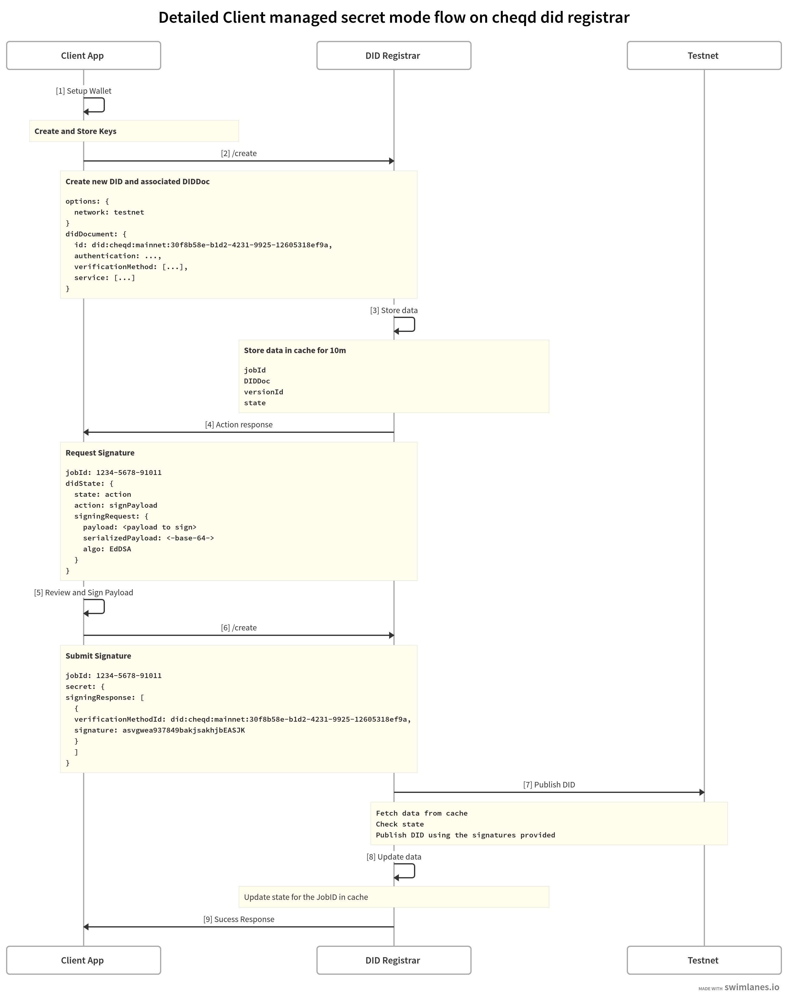

# ADR 004: cheqd DID Registrar

## Status

| Category | Status |
| :--- | :--- |
| **Authors** | Daev Mithran |
| **ADR Stage** | PROPOSED |
| **Implementation Status** | In Progress |
| **Start Date** | 2023-01-30 |
| **Last Updated** | 2023-01-30 |


## Summary

The [`did:cheqd` method ADR](https://docs.cheqd.io/node/architecture/adr-list/adr-002-cheqd-did-method) defines how DIDs are created and read from ledger. According to the [W3C DID Core specification](https://w3c.github.io/did-core/), DID methods are expected to provide [standards-compliant methods of DID and DID Document ("DIDDoc") production](https://w3c.github.io/did-core/#production-and-consumption).

The [cheqd DID Registrar](https://github.com/cheqd/did-registrar) is designed to implement the [DIF _Registrar_ specification](https://identity.foundation/did-registration/) for [`did:cheqd`](https://docs.cheqd.io/node/architecture/adr-list/adr-002-cheqd-did-method) method to enable create/update/deactivate DID operations easily.

The [cheqd DID Registrar](https://github.com/cheqd/did-registrar) also supports the creation of [DID-Linked Resources](https://docs.cheqd.io/identity/guides/did-resolver) for example, schemas, credential definitions, status lists, trust registries and logos. 

## Architecture

The DID create/update/deactivate functions raise architectural questions around key management, since they typically involve the generation and use of private keys and other secrets.

The DID registrar can operate in the following modes:

1. Internal Secret Mode
2. External Secret Mode
3. Client Managed Secret Mode :heavy_check_mark:

### Internal Secret Mode
In this mode, the DID Registrar is responsible for generating the DID controller cryptogprahic keys used in DID operations. Therefore, a DID Registrar used in this mode is considered a highly trusted component which should be fully under the control of a DID controller. If it is operated as a remotely hosted service, secure connection protocols such as TLS, DIDComm, etc. MUST be used.

### External Secret Mode
In this mode, the DID Registrar does not itself have access to the cryptographic keys used in DID operations, but it has a way of accessing an external wallet in order to perform cryptographic operations such as generating signatures.

### Client Managed Secret Mode
In this mode, the DID Registrar does not itself have access to the cryptographic keys used in DID operations, but it will ask the client to perform operations such as generating keys and signatures in a separate action from using the Registrar.

The cheqd DID Registrar **only supports** the [Client Managed Secret Mode](https://identity.foundation/did-registration/#client-managed-secret-mode), considering the security and scalability of the registrar. The workflow for all the operations follows the protocol below:



In the above diagram you can see the following steps

1. Request Operation
    * The client requests a DID operation providing the required fields
2. Return JobId and Serialized Payload
    * The registrar responds with a JobId and a base64 encoded serialized payload
    * The serialized payload should be signed by all the verificationMethods belonging to the controllers of the DID Document
3. Submit JobId and SigningResponse
    * Submit the JobId and the SigningResponse's to the same api
4. Validate signature and Complete Operation
    * The registrar validates the signature for the provided DID Document
    * Submits the DID operation request to the network

***
<br>


## DID Operations

### Create

**Endpoint**: `/1.0/create` <br>
Provide a DID Document payload according to the [w3c did core specification](https://www.w3.org/TR/did-core/#dfn-did-documents) in the request body.


The payload can also be created using our helper endpoint `/1.0/did-document`, which requires the following options to construct the DID Document payload

1. Verification Method Type
2. Method Specific Algorithm
3. Network
4. PublicKey Hex encoded string


<details>
<summary>Request Operation</summary>

```json
{
	"didDocument": {
		"id": "did:cheqd:testnet:b84817b8-43ee-4483-98c5-f03760816411",
		"controller": [
			"did:cheqd:testnet:b84817b8-43ee-4483-98c5-f03760816411"
		],
		"verificationMethod": [{
			"id": "did:cheqd:testnet:b84817b8-43ee-4483-98c5-f03760816411#key-1",
			"type": "Ed25519VerificationKey2020",
			"controller": "did:cheqd:testnet:b84817b8-43ee-4483-98c5-f03760816411",
			"publicKeyMultibase": "z6MknkzLUEP5cxqqsaysNMWoh8NJRb3YsowTCj2D6yhwyEdj"
		}],
		"authentication": [
			"did:cheqd:testnet:b84817b8-43ee-4483-98c5-f03760816411#key-1"
		]
	}
}
```

</details>

<details>
<summary>Response</summary>

```json
{
  "jobId": "54d1b72a-ec50-4648-b031-aaa3c6c7ed40",
  "didState": {
    "did": "did:cheqd:testnet:b84817b8-43ee-4483-98c5-f03760816411",
    "state": "action",
    "action": "signPayload",
    "description": "Please sign the following payload with the keys in verificationMethod and add the signingResponse in secret",
    "signingRequest": [
      {
        "kid": "did:cheqd:testnet:b84817b8-43ee-4483-98c5-f03760816411#key-1",
        "type": "Ed25519VerificationKey2020",
        "alg": "EdDSA",
        "serializedPayload": "EjZkaWQ6Y2hlcWQ6dGVzdG5ldDpiODQ4MTdiOC00M2VlLTQ0ODMtOThjNS1mMDM3NjA4MTY0MTEaNmRpZDpjaGVxZDp0ZXN0bmV0OmI4NDgxN2I4LTQzZWUtNDQ4My05OGM1LWYwMzc2MDgxNjQxMSLEAQo8ZGlkOmNoZXFkOnRlc3RuZXQ6Yjg0ODE3YjgtNDNlZS00NDgzLTk4YzUtZjAzNzYwODE2NDExI2tleS0xEhpFZDI1NTE5VmVyaWZpY2F0aW9uS2V5MjAyMBo2ZGlkOmNoZXFkOnRlc3RuZXQ6Yjg0ODE3YjgtNDNlZS00NDgzLTk4YzUtZjAzNzYwODE2NDExIjB6Nk1rbmt6TFVFUDVjeHFxc2F5c05NV29oOE5KUmIzWXNvd1RDajJENnlod3lFZGoqPGRpZDpjaGVxZDp0ZXN0bmV0OmI4NDgxN2I4LTQzZWUtNDQ4My05OGM1LWYwMzc2MDgxNjQxMSNrZXktMWIkNTRhYTQ5YzEtYjIwMi00YWViLWFiM2EtMmE2MDljMWU0MGYw"
      }
    ],
    "secret": {
      "signingResponse": [
        "e.g. { verificationMethodId: did:cheqd:testnet:qsqdcansoica#key-1, signature: aca1s12q14213casdvaadcfas }"
      ]
    }
  }
}

```

</details>


<details>
<summary>Submit Signature</summary>

```json
{
	"jobId": "54d1b72a-ec50-4648-b031-aaa3c6c7ed40",
	"secret": {
		"signingResponse": [{
			"verificationMethodId": "did:cheqd:testnet:b84817b8-43ee-4483-98c5-f03760816411#key-1",
			"signature": "9Cmk0ATyr0niF2WLs8CjTfPCXIZcsjw80JsRpTT5gvcOruFvrSJu6NVwLW5psQaXFoixuOQE9uolb3N-xKnfCQ"
		}]
	}
}

```

</details>


<details>
<summary>Response</summary>

```json
{
  "jobId": "54d1b72a-ec50-4648-b031-aaa3c6c7ed40",
  "didState": {
    "did": "did:cheqd:testnet:b84817b8-43ee-4483-98c5-f03760816411",
    "state": "finished",
    "secret": {
      "signingResponse": [
        {
          "verificationMethodId": "did:cheqd:testnet:b84817b8-43ee-4483-98c5-f03760816411#key-1",
          "signature": "9Cmk0ATyr0niF2WLs8CjTfPCXIZcsjw80JsRpTT5gvcOruFvrSJu6NVwLW5psQaXFoixuOQE9uolb3N-xKnfCQ"
        }
      ]
    },
    "didDocument": {
      "id": "did:cheqd:testnet:b84817b8-43ee-4483-98c5-f03760816411",
      "controller": [
        "did:cheqd:testnet:b84817b8-43ee-4483-98c5-f03760816411"
      ],
      "verificationMethod": [
        {
          "id": "did:cheqd:testnet:b84817b8-43ee-4483-98c5-f03760816411#key-1",
          "type": "Ed25519VerificationKey2020",
          "controller": "did:cheqd:testnet:b84817b8-43ee-4483-98c5-f03760816411",
          "publicKeyMultibase": "z6MknkzLUEP5cxqqsaysNMWoh8NJRb3YsowTCj2D6yhwyEdj"
        }
      ],
      "authentication": [
        "did:cheqd:testnet:b84817b8-43ee-4483-98c5-f03760816411#key-1"
      ]
    }
  }
}

```

</details>

<br>

### Update

**Endpoint**: `/1.0/update` <br>
Only setDidDocument operation is supported in the cheqd-did-registrar. To update a DID Document, fetch the body of the DID Document you want to change from the DID Resolver, make the relevant updates and pass it to the request operation.

<details>
<summary>Request Operation</summary>

```json
{
	"did": "did:cheqd:testnet:b84817b8-43ee-4483-98c5-f03760816411",
	"didDocumentOperation": [
		"setDidDocument"
	],
	"didDocument": [{
		"id": "did:cheqd:testnet:b84817b8-43ee-4483-98c5-f03760816411",
		"controller": [
			"did:cheqd:testnet:b84817b8-43ee-4483-98c5-f03760816411"
		],
		"verificationMethod": [{
			"id": "did:cheqd:testnet:b84817b8-43ee-4483-98c5-f03760816411#key-1",
			"type": "Ed25519VerificationKey2020",
			"controller": "did:cheqd:testnet:b84817b8-43ee-4483-98c5-f03760816411",
			"publicKeyMultibase": "z6MknkzLUEP5cxqqsaysNMWoh8NJRb3YsowTCj2D6yhwyEdj"
		}],
		"authentication": [
			"did:cheqd:testnet:b84817b8-43ee-4483-98c5-f03760816411#key-1"
		],
		"service": [{
			"id": "did:cheqd:testnet:b84817b8-43ee-4483-98c5-f03760816411#rand",
			"type": "rand",
			"serviceEndpoint": [
				"https://rand.in"
			]
		}]
	}]
}
```

</details>

<details>
<summary>Response</summary>

```json
{
  "jobId": "a28cd684-3ed6-43fe-9066-90b32345bd40",
  "didState": {
    "did": "did:cheqd:testnet:b84817b8-43ee-4483-98c5-f03760816411",
    "state": "action",
    "action": "signPayload",
    "description": "Please sign the following payload with the keys in verificationMethod and add the signingResponse in secret",
    "signingRequest": [
      {
        "kid": "did:cheqd:testnet:b84817b8-43ee-4483-98c5-f03760816411#key-1",
        "type": "Ed25519VerificationKey2020",
        "alg": "EdDSA",
        "serializedPayload": "EjZkaWQ6Y2hlcWQ6dGVzdG5ldDpiODQ4MTdiOC00M2VlLTQ0ODMtOThjNS1mMDM3NjA4MTY0MTEaNmRpZDpjaGVxZDp0ZXN0bmV0OmI4NDgxN2I4LTQzZWUtNDQ4My05OGM1LWYwMzc2MDgxNjQxMSLEAQo8ZGlkOmNoZXFkOnRlc3RuZXQ6Yjg0ODE3YjgtNDNlZS00NDgzLTk4YzUtZjAzNzYwODE2NDExI2tleS0xEhpFZDI1NTE5VmVyaWZpY2F0aW9uS2V5MjAyMBo2ZGlkOmNoZXFkOnRlc3RuZXQ6Yjg0ODE3YjgtNDNlZS00NDgzLTk4YzUtZjAzNzYwODE2NDExIjB6Nk1rbmt6TFVFUDVjeHFxc2F5c05NV29oOE5KUmIzWXNvd1RDajJENnlod3lFZGoqPGRpZDpjaGVxZDp0ZXN0bmV0OmI4NDgxN2I4LTQzZWUtNDQ4My05OGM1LWYwMzc2MDgxNjQxMSNrZXktMWIkNTRhYTQ5YzEtYjIwMi00YWViLWFiM2EtMmE2MDljMWU0MGYw"
      }
    ],
    "secret": {
      "signingResponse": [
        "e.g. { verificationMethodId: did:cheqd:testnet:qsqdcansoica#key-1, signature: aca1s12q14213casdvaadcfas }"
      ]
    }
  }
}

```

</details>


<details>
<summary>Submit Signature</summary>

```json
{
	"jobId": "a28cd684-3ed6-43fe-9066-90b32345bd40",
	"secret": {
		"signingResponse": [{
			"verificationMethodId": "did:cheqd:testnet:b84817b8-43ee-4483-98c5-f03760816411#key-1",
			"signature": "w7TVYHFgVtxA_k_V-Oa2o4tgg2mXhGoA1ZPsQxohCq2Yu2HKifC_hiTtmzconsmSte2uJdA51TBnKHv2OOkbBQ"
		}]
	}
}

```

</details>

<details>
<summary>Response</summary>

```json
{
  "jobId": "a28cd684-3ed6-43fe-9066-90b32345bd40",
  "didState": {
    "did": "did:cheqd:testnet:b84817b8-43ee-4483-98c5-f03760816411",
    "state": "finished",
    "secret": {
      "signingResponse": [
        {
          "verificationMethodId": "did:cheqd:testnet:b84817b8-43ee-4483-98c5-f03760816411#key-1",
          "signature": "w7TVYHFgVtxA_k_V-Oa2o4tgg2mXhGoA1ZPsQxohCq2Yu2HKifC_hiTtmzconsmSte2uJdA51TBnKHv2OOkbBQ"
        }
      ]
    },
    "didDocument": {
      "id": "did:cheqd:testnet:b84817b8-43ee-4483-98c5-f03760816411",
      "controller": [
        "did:cheqd:testnet:b84817b8-43ee-4483-98c5-f03760816411"
      ],
      "verificationMethod": [
        {
          "id": "did:cheqd:testnet:b84817b8-43ee-4483-98c5-f03760816411#key-1",
          "type": "Ed25519VerificationKey2020",
          "controller": "did:cheqd:testnet:b84817b8-43ee-4483-98c5-f03760816411",
          "publicKeyMultibase": "z6MknkzLUEP5cxqqsaysNMWoh8NJRb3YsowTCj2D6yhwyEdj"
        }
      ],
      "authentication": [
        "did:cheqd:testnet:b84817b8-43ee-4483-98c5-f03760816411#key-1"
      ],
      "service": [
        {
          "id": "did:cheqd:testnet:b84817b8-43ee-4483-98c5-f03760816411#rand",
          "type": "rand",
          "serviceEndpoint": [
            "https://rand.in"
          ]
        }
      ]
    }
  }
}


```

</details>

<br>


### Deactivate

**Endpoint**: `/1.0/deactivate`

<details>
<summary>Request Operation</summary>

```json
{
  "did": "did:cheqd:testnet:b84817b8-43ee-4483-98c5-f03760816411"
}

```
</details>

<details>
<summary>Response</summary>

```json
{
  "jobId": "01dbd549-1344-4d3a-b438-36ca6c66159b",
  "didState": {
    "did": "did:cheqd:testnet:b84817b8-43ee-4483-98c5-f03760816411",
    "state": "action",
    "action": "signPayload",
    "description": "Please sign the following payload with the keys in verificationMethod and Add the signingResponse in secret",
    "signingRequest": [
      {
        "kid": "did:cheqd:testnet:b84817b8-43ee-4483-98c5-f03760816411#key-1",
        "type": "Ed25519VerificationKey2020",
        "alg": "EdDSA",
        "serializedPayload": "CjZkaWQ6Y2hlcWQ6dGVzdG5ldDpiODQ4MTdiOC00M2VlLTQ0ODMtOThjNS1mMDM3NjA4MTY0MTESJDFjNDZjYjkxLTZkMmUtNDMxMC04ZTk0LWI1YWNlODlmZWI4Mg=="
      }
    ],
    "secret": {
      "signingResponse": [
        "e.g. { verificationMethodId: did:cheqd:testnet:qsqdcansoica#key-1, signature: aca1s12q14213casdvaadcfas }"
      ]
    }
  }
}

```
</details>


<details>
<summary>Submit Signature</summary>

```json
{
	"jobId": "01dbd549-1344-4d3a-b438-36ca6c66159b",
	"secret": {
		"signingResponse": [{
			"verificationMethodId": "did:cheqd:testnet:b84817b8-43ee-4483-98c5-f03760816411#key-1",
			"signature": "64FTNMfwnHGh2tq9YatdMdTlT1-5f34RvD_gVHVK-XF5ALE1WX_TO9U17WpBB3ZJ3PFdc1KocT7eEqdSTi5wCA"
		}]
	}
}

```
</details>

<details>
<summary>Response</summary>

```json
{
  "jobId": "01dbd549-1344-4d3a-b438-36ca6c66159b",
  "didState": {
    "did": "did:cheqd:testnet:b84817b8-43ee-4483-98c5-f03760816411",
    "state": "finished",
    "secret": {
      "signingResponse": [
        {
          "verificationMethodId": "did:cheqd:testnet:b84817b8-43ee-4483-98c5-f03760816411#key-1",
          "signature": "64FTNMfwnHGh2tq9YatdMdTlT1-5f34RvD_gVHVK-XF5ALE1WX_TO9U17WpBB3ZJ3PFdc1KocT7eEqdSTi5wCA"
        }
      ]
    },
    "didDocument": {
      "id": "did:cheqd:testnet:b84817b8-43ee-4483-98c5-f03760816411"
    }
  }
}

```
</details>

<br>

## Resource Operations

<br>

### Create
**Endpoint**: `/1.0/{:did}/create-resource` <br>
Provide an existing DID as the path parameter, and the request body with resource name, type and base64 encoded data

<details>
<summary>Request Operation</summary>

```json
{
  "data": "SGVsbG8gV29ybGQ=",
  "name": "ResourceName",
  "type": "TextDocument"
}

```
</details>

<details>
<summary>Response</summary>

```json
{
  "jobId": "37e4c98e-d876-4e7b-b113-20ae3620174a",
  "resourceState": {
    "did": "b84817b8-43ee-4483-98c5-f03760816411",
    "state": "action",
    "action": "signPayload",
    "description": "Please sign the following payload with the keys in verificationMethod of the DID used in the path and add the signingResponse in secret",
    "signingRequest": [
      {
        "kid": "did:cheqd:testnet:b84817b8-43ee-4483-98c5-f03760816411#key-1",
        "type": "Ed25519VerificationKey2020",
        "alg": "EdDSA",
        "serializedPayload": "CgtIZWxsbyBXb3JsZBIkYjg0ODE3YjgtNDNlZS00NDgzLTk4YzUtZjAzNzYwODE2NDExGiRjYjk1MGUyNy0yZDNmLTQzOWEtYjA1Yy03ZjZmOTMzMTJiM2IiDFJlc291cmNlTmFtZTIMVGV4dERvY3VtZW50"
      }
    ],
    "secret": {
      "signingResponse": [
        "e.g. { verificationMethodId: did:cheqd:testnet:qsqdcansoica#key-1, signature: aca1s12q14213casdvaadcfas }"
      ]
    }
  }
}

```
</details>


<details>
<summary>Submit Signature</summary>

```json
{
	"jobId": "37e4c98e-d876-4e7b-b113-20ae3620174a",
	"secret": {
		"signingResponse": [{
			"verificationMethodId": "did:cheqd:testnet:b84817b8-43ee-4483-98c5-f03760816411#key-1",
			"signature": "kxS7026RkqvY_etCdj_SHHDRisMQM-Vs8BG4h3yIPathzj5GPs_LmA0Ve5Z6U00fdu4K5gaDC_x3WUJXfnRhBg"
		}]
	}
}

```
</details>

<details>
<summary>Response</summary>

```json
{
  "jobId": "37e4c98e-d876-4e7b-b113-20ae3620174a",
  "resourceState": {
    "resourceId": "cb950e27-2d3f-439a-b05c-7f6f93312b3b",
    "state": "finished",
    "secret": {
      "signingResponse": [
        {
          "verificationMethodId": "did:cheqd:testnet:b84817b8-43ee-4483-98c5-f03760816411#key-1",
          "signature": "kxS7026RkqvY_etCdj_SHHDRisMQM-Vs8BG4h3yIPathzj5GPs_LmA0Ve5Z6U00fdu4K5gaDC_x3WUJXfnRhBg"
        }
      ]
    },
    "resource": {
      "collectionId": "b84817b8-43ee-4483-98c5-f03760816411",
      "id": "cb950e27-2d3f-439a-b05c-7f6f93312b3b",
      "name": "ResourceName",
      "resourceType": "TextDocument",
    }
  }
}

```
</details>

<br>

## References

- [W3C Decentralized Identifiers (DIDs)](https://www.w3.org/TR/did-core/) recommendation
- [DIF DID Registrar](https://identity.foundation/did-registration) specification
- [Universal Registrar driver development](https://github.com/decentralized-identity/universal-registrar/blob/main/docs/driver-development.md) guide
- [DID-Linked Resources](adr-002-did-linked-resources.md)
