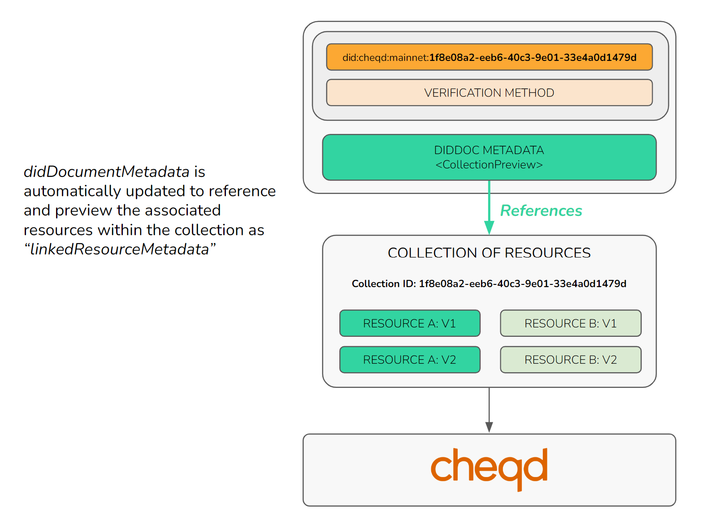

# Technical composition of DID-Linked Resources

## Formatting a Resource

**"Resources"** are identified with a [`did:cheqd` Decentralized Identifier](https://docs.cheqd.io/node/architecture/adr-list/adr-008-ledger-resources) with a [Universally Unique Identifier (UUID)](https://www.uuidgenerator.net/) that acts as a permanently-accessible link to fetch the resources from the cheqd ledger. We refer to this as the "**resource ID**".

Using UUIDs, we can have a **high level of confidence that no two identical resource IDs will ever be created**. This is important for ensuring the integrity and identifiabilty of each individual resource.

<figure><figcaption><p>Image showing how a cheqd resource is formatted</p></figcaption></figure>

This will be explained further in the section on DID URL dereferencing to fetch a resource.

## Understanding the DID and Collection relationship

Resources are organised into groups called "**Collections**". Each DID may have an associated Collection, and the Collection ID is **derived from the unique identifier of the DID**.

Collections can store any type of Resource, but for the purpose of this documentation we will focus on the use case where the Collection is _used for storing a set of schemas_.

The most important concept used in this design is that each on-ledger **Collection** is **identified using a DID** and is **described using a DID Document**.

The DID Document acts as metadata, providing information about the **Collection**, such as who is able to update it, when it was created and what are the latest and deprecated versions of **Resources** within the **Collection**.

For example, the following DID:

did:cheqd:mainnet:1f8e08a2-eeb6-40c3-9e01-33e4a0d1479d

will derive the Collection ID: **1f8e08a2-eeb6-40c3-9e01-33e4a0d1479d**

<figure><figcaption><p>Image showing the relationship between DIDs and Collection</p></figcaption></figure>

A Collection is created using a _createResource_ transaction, and specifying the Collection ID as the same identifier as that of the parent DID.


Note that the Collection ID may take the syntactical form of a 'Hyperledger Indy' DID identifier **or** may be a [Universally Unique Identifier (UUID)](https://www.uuidgenerator.net/). This is described in the [cheqd DID method](https://docs.cheqd.io/node/architecture/adr-list/adr-002-cheqd-did-method).


## Creating a Resource inside a Collection, associated with a DID

To create a **"resource"**, you must already have created a 'parent' DID, from which the Collection ID can be derived. When you carry out the `createResource` transaction, you must:

1. Generate **a new, unique UUID** for the Resources
2. Specify the **same Collection ID** as the unique identifier of the parent DID
3. Sign the `createResource` transaction with the **Verification Method keys** of the parent DID.

This is show in the diagram below:

<figure><figcaption><p>Image showing how a resource is associated with a DID</p></figcaption></figure>

Example of `createResource` transaction using Veramo SDK:

```json
{
    "kms": "local",
    "payload": {
        "collectionId": "1f8e08a2-eeb6-40c3-9e01-33e4a0d1479d",
        "id": "f3d39687-69f5-4046-a960-3aae86a0d3ca",
        "name": "PassportSchema",
        "resourceType": "CL-Schema",
        "data": "SGVsbG8sIHdvcmxk" // base 64 encoded file 
    },
    "signInputs": [{
        "verificationMethodId": "did:cheqd:testnet:z4ZUuPbs1xyK7y8d#key-1",
        "keyType": "Ed25519",
        "privateKeyHex": "0f5c124886178037952e87e0cdc55d185732577fca19ae877e64ac9ab24a0cc534e5326e70f1a42d785d93048aee806c359ec75a7b06f39253befd1746708438"
    }]
}
```

## Linking DIDs to Resources and Collections

Multiple, linked resources can be stored in a **Collection**, for example, this could be different versions of the same Resource over a period of time or semantically-linked resources. This enables unique resources to be stored directly on-ledger and be **retrievable through DID resolution** and **dereferencing**.

Once you have created a resource, the DID Document will automatically reference the resource and the collection within the `didDocumentMetadata` in a newly defined section called `linkedResourceMetadata`.

This relationship is shown in the diagram below:

<figure><figcaption><p>Image showing how DIDDocMetadata references resources</p></figcaption></figure>

For simplicity, we will focus on the use case where a Resource is a **schema**. The same logic used in fetching schemas from the ledger can be applied to any of the aforementioned types of Resources.

The syntax of a Resource metadata for a single schema is as follows:

```json
"linkedResourceMetadata": [
  {
    "resourceURI": "did:cheqd:mainnet:1f8e08a2-eeb6-40c3-9e01-33e4a0d1479d/resources/f3d39687-69f5-4046-a960-3aae86a0d3ca",
    "resourceCollectionId": "1f8e08a2-eeb6-40c3-9e01-33e4a0d1479d",
    "resourceId": "f3d39687-69f5-4046-a960-3aae86a0d3ca",
    "resourceName": "PassportSchema", // First version of a Resource called PassportSchema
    "resourceType": "CL-Schema",
    "mediaType": "application/json",
    "created": "2022-07-19T08:40:00Z",
    "checksum": "7b2022636f6e74656e74223a202274657374206461746122207d0ae3b0c44298",
    "previousVersionId": null, // null if no previous version, otherwise, resourceId of previous version
    "nextVersionId": null, // null if no new version, otherwise, resourceId of new version
  }
]
```

### Media Types allowed in Resources

Any [valid IANA Media Type](https://developer.mozilla.org/en-US/docs/Web/HTTP/Basics_of_HTTP/MIME_types) (colloquially known as "file type") is allowed as an on-ledger Resource. The only restriction is that the Resource should fit within a block, which de-facto restricts it to \~190KB to fit within the \~200KB block limit. Any files larger than this are recommended to be stored and linked via long-term immutable file discovery mechanisms such as [IPFS](https://ipfs.io/).

A [Golang library is used to derive and set media type](https://ipfs.io/) based on the **file extension of provided resource file**. This makes it much simpler to maintain, since there is no list of file types that the cheqd ledger needs to gatekeep.

## Resource Parameters

The following list defines which specific parameters a resource MUST contain to conform with this specification, and which parameters are OPTIONAL.

| `"resourceUri"`          | <p>A <a href="https://infra.spec.whatwg.org/#string">string</a> or a <a href="https://infra.spec.whatwg.org/#maps">map</a> that conforms to the rules of [RFC3986 URIs](https://www.w3.org/TR/did-core/#dfn-uri) which SHOULD directly lead to a location where the resource can be accessed from.</p><p><br>For example: <code>did:cheqd:mainnet:1f8e08a2-eeb6-40c3-9e01-33e4a0d1479d/resources/f3d39687-69f5-4046-a960-3aae86a0d3ca</code></p><p><br></p> |
| ------------------------ | ----------------------------------------------------------------------------------------------------------------------------------------------------------------------------------------------------------------------------------------------------------------------------------------------------------------------------------------------------------------------------------------------------------------------------------------------------------------------------------------------------------------------------------------------- |
| `"resourceCollectionId"` | <p>A <a href="https://infra.spec.whatwg.org/#string">string</a> that conforms to a method specific unique identifier format.</p><p><br>For example: <code>46e2af9a-2ea0-4815-999d-730a6778227c</code></p>                                                                                                                                                                                                                                                                                                                                       |
| `"resourceId"`           | <p>A <a href="https://infra.spec.whatwg.org/#string">string</a> that conforms to a method specific unique identifier format.</p><p><br>For example: <code>0f964a80-5d18-4867-83e3-b47f5a756f02</code></p>                                                                                                                                                                                                                                                                                                                                       |
| `"resourceName"`         | <p>A <a href="https://infra.spec.whatwg.org/#string">string</a> that uniquely names and identifies a resource. This property, along with the resourceType below, can be used to track version changes within a resource.</p><p><br>For example: <code>degreeLaw</code></p>                                                                                                                                                                                                                                                                      |
| `"resourceType"`         | <p>A <a href="https://infra.spec.whatwg.org/#string">string</a> that identifies the type of resource. This property, along with the resourceName above, can be used to track version changes within a resource. Not to be confused with media type. (TBC to add to DID Spec Registries)</p><p><br>For example: <code>JSONSchema2020</code></p>                                                                                                                                                                                                  |
| `"mediaType"`            | <p>A <a href="https://infra.spec.whatwg.org/#string">string</a> that identifies the IANA-registered Media Type for a resource.</p><p><br>For example: <code>application/json</code></p>                                                                                                                                                                                                                                                                                                                                                         |
| `"created"`              | <p>A <a href="https://www.rfc-editor.org/rfc/rfc8259#section-7">JSON String</a> serialized as an <a href="https://www.w3.org/TR/xmlschema11-2/#dateTime">XML Datetime</a> normalized to UTC 00:00:00 and without sub-second decimal precision.</p><p><br>For example: <code>2020-12-20T19:17:47Z</code></p>                                                                                                                                                                                                                                     |
| `"checksum"`             | <p>A string that provides a <a href="https://en.wikipedia.org/wiki/Checksum">checksum</a> (e.g. SHA256, MD5) for the resource to facilitate data integrity.</p><p><br>For example: <code>7b2022636f6e74656e74223a202274657374206461746122207d0ae3b0c44298</code></p>                                                                                                                                                                                                                                                                            |
| `"previousVersionId"`    | The value of the property MUST be an [string](https://infra.spec.whatwg.org/#ascii-string). This is the previous version of a resource with the same resourceName and resourceType. The value must be an empty string if there is no previous version.</p><p><br> For example: <code> 67618cfa-7a1d-4be3-b9b2-3a9ea52af305 </code>                                                                                                                                                           |
| `"nextVersionId"`        | <p>The value of the property <em>MUST</em> be an <a href="https://infra.spec.whatwg.org/#ascii-string">string</a>. The value must be an empty string if there is no next version.</p><p><br>                                                                                                                                                                                                                                                                                          |

## Example of a resolved DID with an associated Resource

Let’s take a look at a fully resolved **output response** for a **DID with a Collection and single associated Resource:**

```json
{
  "@context": "https://w3id.org/did-resolution/v1",
  "didResolutionMetadata": {
    "contentType": "application/did+ld+json",
    "retrieved": "2022-11-28T05:01:50Z",
    "did": {
      "didString": "did:cheqd:mainnet:1f8e08a2-eeb6-40c3-9e01-33e4a0d1479d",
      "methodSpecificId": "1f8e08a2-eeb6-40c3-9e01-33e4a0d1479d",
      "method": "cheqd"
    }
  },
  "didDocument": {
    "@context": [
      "https://www.w3.org/ns/did/v1"
    ],
    "id": "did:cheqd:mainnet:1f8e08a2-eeb6-40c3-9e01-33e4a0d1479d",
    "controller": [
      "did:cheqd:mainnet:1f8e08a2-eeb6-40c3-9e01-33e4a0d1479d"
    ],
    "verificationMethod": [
      {
        "id": "did:cheqd:mainnet:1f8e08a2-eeb6-40c3-9e01-33e4a0d1479d#verKey1",
        "type": "Ed25519VerificationKey2020",
        "controller": "did:cheqd:mainnet:1f8e08a2-eeb6-40c3-9e01-33e4a0d1479d",
        "publicKeyMultibase": "zB5wPyMGYL4LbT424Z7yXHm6nZrrLqZZg9eWtVmedodys"
      },
    ],
    "authentication": [
      "did:cheqd:mainnet:1f8e08a2-eeb6-40c3-9e01-33e4a0d1479d#verKey1"
    ]
  },
  "didDocumentMetadata": {
    "created": "2015-04-10T11:51:40Z",
    "versionId": "9D760202FF2BD4A12344283627FF251BE6C48812C7626C3564C1C2843CAB9085",
    "linkedResourceMetadata": [
      { // First version of a Resource called PassportSchema
        "resourceURI": "did:cheqd:mainnet:1f8e08a2-eeb6-40c3-9e01-33e4a0d1479d/resources/f3d39687-69f5-4046-a960-3aae86a0d3ca",
        "resourceCollectionId": "1f8e08a2-eeb6-40c3-9e01-33e4a0d1479d", // Derived Collection ID
        "resourceId": "f3d39687-69f5-4046-a960-3aae86a0d3ca",
        "resourceName": "PassportSchema",
        "resourceType": "CL-Schema",
        "mediaType": "application/json",
        "created": "2015-04-16T14:01:42Z",
        "checksum": "72f9d4f96c6f4fedcfd5d1691b10d60d14a008cace269ddb35342aa8d43a30fc",
        "previousVersionId": null, // No previous or next versions
        "nextVersionId": null // No previous or next versions
      }
    ]
  }
}
```

## Example of DID Document with multiple versions of the same resource

Let’s take a look at a fully resolved **output response** for a **DID with a Collection and multiple associated Resources:**

```json
{
  "@context": "https://w3id.org/did-resolution/v1",
  "didResolutionMetadata": {
    "contentType": "application/did+ld+json",
    "retrieved": "2022-11-28T05:01:50Z",
    "did": {
      "didString": "did:cheqd:mainnet:1f8e08a2-eeb6-40c3-9e01-33e4a0d1479d",
      "methodSpecificId": "1f8e08a2-eeb6-40c3-9e01-33e4a0d1479d",
      "method": "cheqd"
    }
  },
  "didDocument": {
    "@context": [
      "https://www.w3.org/ns/did/v1"
    ],
    "id": "did:cheqd:mainnet:1f8e08a2-eeb6-40c3-9e01-33e4a0d1479d",
    "controller": [
      "did:cheqd:mainnet:1f8e08a2-eeb6-40c3-9e01-33e4a0d1479d"
    ],
    "verificationMethod": [
      {
        "id": "did:cheqd:mainnet:1f8e08a2-eeb6-40c3-9e01-33e4a0d1479d#verKey1",
        "type": "Ed25519VerificationKey2020",
        "controller": "did:cheqd:mainnet:1f8e08a2-eeb6-40c3-9e01-33e4a0d1479d",
        "publicKeyMultibase": "zB5wPyMGYL4LbT424Z7yXHm6nZrrLqZZg9eWtVmedodys"
      },
    ],
    "authentication": [
      "did:cheqd:mainnet:1f8e08a2-eeb6-40c3-9e01-33e4a0d1479d#verKey1"
    ]
  },
  "didDocumentMetadata": {
    "created": "2015-04-10T11:51:40Z",
    "versionId": "9D760202FF2BD4A12344283627FF251BE6C48812C7626C3564C1C2843CAB9085",
    "linkedResourceMetadata": [
      { // First version of a Resource called PassportSchema
        "resourceURI": "did:cheqd:mainnet:1f8e08a2-eeb6-40c3-9e01-33e4a0d1479d/resources/f3d39687-69f5-4046-a960-3aae86a0d3ca",
        "resourceCollectionId": "1f8e08a2-eeb6-40c3-9e01-33e4a0d1479d", // Derived Collection ID
        "resourceId": "f3d39687-69f5-4046-a960-3aae86a0d3ca",
        "resourceName": "PassportSchema", // Resource name remains the same
        "resourceType": "CL-Schema", // Resource type remains the same
        "mediaType": "application/json",
        "created": "2015-04-16T14:01:42Z",
        "checksum": "72f9d4f96c6f4fedcfd5d1691b10d60d14a008cace269ddb35342aa8d43a30fc",
        "previousVersionId": null,
        "nextVersionId": "8f86d7aa-dc6a-4cee-ac37-97956542d587"
      },
      { // Second version of a Resource called PassportSchema
        "resourceURI": "did:cheqd:mainnet:1f8e08a2-eeb6-40c3-9e01-33e4a0d1479d/resources/8f86d7aa-dc6a-4cee-ac37-97956542d587",
        "resourceCollectionId": "1f8e08a2-eeb6-40c3-9e01-33e4a0d1479d", // Derived Collection ID
        "resourceId": "8f86d7aa-dc6a-4cee-ac37-97956542d587",
        "resourceName": "PassportSchema", // Resource name remains the same
        "resourceType": "CL-Schema", // Resource type remains the same
        "mediaType": "application/json",
        "created": "2020-06-16T14:02:39Z",
        "checksum": "ec54f8019b869d5511b42678ea859b9dc185f487bf1776cb079fda0930331689",
        "previousVersionId": "f3d39687-69f5-4046-a960-3aae86a0d3ca",
        "nextVersionId": "bd128013-636d-4240-b48b-fc88bf9ee8de"
      },
      { // Third version of a Resource called PassportSchema
        "resourceURI": "did:cheqd:mainnet:1f8e08a2-eeb6-40c3-9e01-33e4a0d1479d/resources/bd128013-636d-4240-b48b-fc88bf9ee8de",
        "resourceCollectionId": "1f8e08a2-eeb6-40c3-9e01-33e4a0d1479d", // Derived Collection ID
        "resourceId": "bd128013-636d-4240-b48b-fc88bf9ee8de",
        "resourceName": "PassportSchema", // Resource name remains the same
        "resourceType": "CL-Schema", // Resource type remains the same
        "mediaType": "application/json",
        "created": "2022-09-16T14:10:46Z",
        "checksum": "cc187364f3bf071e5411cb6074d9c44a1b416a32b8eea581d113e486d1d586cf",
        "previousVersionId": "8f86d7aa-dc6a-4cee-ac37-97956542d587",
        "nextVersionId": null
      }
    ]
  }
}
```

Collections are identified by a **Collection ID** which is a **unique identifier** of the **linked, parent DID**. Within the _DID Document Metadata_ of the _Collection DIDDoc_, the Linked Resource metadata describes Resources within this Collection:

Note that the Linked Resource output above does not show the actual data / schema attributes when displaying all Resources in this Collection. It only shows Resource _metadata_.

This logic prevents `GetResourceCollection` requests returning large quantities of data, which may be stored across multiple Resources within a Collection.

In order to fetch the actual data, it is necessary to query **the specific Resource**, rather than **the entire Collection**.

For more information about the particulars of requests and responses, please refer to our [**ADR on Resources on ledger**](https://docs.cheqd.io/node/architecture/adr-list/adr-008-ledger-resources).

## Versioning and Archiving Resources

As shown in the examples above, there may be **previous** and **next** versions of the **Resource ID**.

Whenever a Resource is updated, a new UUID must be generated. The new Resource references the older version, so the UUID is effectively a version number.

Importantly, the `collectionId,` `resourceName` and the `resourceType` of the Resource **must remain the same**.

For example, a Resource with the name `PassportSchema` must always have the **same** **name** and **resource type** to be considered for previous/next version linking.

This could be used, for example, to find the version active at a particular point in time:

## Query based dereferencing

Fetching resources using DID resolvers and DID URLs is hugely desirable. Up until this point, we have shown resources identified using **path-based syntax**.

However, query-based syntax should also be enabled to **allow more granular and specific searches within a particular Collection**.

To enable combined resolution/dereferencing behavior, cheqd are defining multiple query-based [DID URL](https://www.w3.org/TR/did-core/#dfn-did-urls) parameters to fetch `resource` or associated metadata. If a [DID method](https://www.w3.org/TR/did-core/#dfn-did-methods) specification supports these parameters, and if a [DID URL](https://www.w3.org/TR/did-core/#dfn-did-urls) using that method includes the parameter with a valid value, then when a resolver calls the associated [VDR](https://www.w3.org/TR/did-core/#dfn-verifiable-data-registry) using that [DID URL](https://www.w3.org/TR/did-core/#dfn-did-urls), the VDR returns the identified digital resource, **not** the [DID document](https://www.w3.org/TR/did-core/#dfn-did-documents).


**IMPORTANT**: DID URL queries should be fully qualified so that they **uniquely identify a single resource, or single resource version unless expressly specified**.



Note: This work on query based dereferencing is still a work in progress


Selection of proposed query-based **input parameters**:

| `"resourceId"`            | [String](https://infra.spec.whatwg.org/#string)               | did:cheqd:mainnet:46e2af9a-2ea0-4815-999d-730a6778227c?resourceId=0f964a80-5d18-4867-83e3-b47f5a756f02                                                                                                                                                                                                                                                                                                                            |
| ------------------------- | ------------------------------------------------------------- | --------------------------------------------------------------------------------------------------------------------------------------------------------------------------------------------------------------------------------------------------------------------------------------------------------------------------------------------------------------------------------------------------------------------------------- |
| `"resourceName"`          | [String](https://infra.spec.whatwg.org/#string)               | did:cheqd:mainnet:46e2af9a-2ea0-4815-999d-730a6778227c?resourceName=degreeLaw                                                                                                                                                                                                                                                                                                                                                     |
| `"resourceType"`          | [String](https://infra.spec.whatwg.org/#string)               | did:cheqd:mainnet:46e2af9a-2ea0-4815-999d-730a6778227c?resourceName=degreeLaw\&resourceType=JSONSchema2020                                                                                                                                                                                                                                                                                                                        |
| `"resourceVersionId"`     | [String](https://infra.spec.whatwg.org/#string)               | did:cheqd:mainnet:46e2af9a-2ea0-4815-999d-730a6778227c?resourceName=degreeLaw\&resourceVersionId=1.3.1                                                                                                                                                                                                                                                                                                                            |
| `"versionTime"`           | [XML Datetime](https://www.w3.org/TR/xmlschema11-2/#dateTime) | did:cheqd:mainnet:46e2af9a-2ea0-4815-999d-730a6778227c?resourceName=degreeLaw\&resourceType=JSONSchema2020\&versionTime=2015-03-11T05:30:02Z                                                                                                                                                                                                                                                                                      |
| `"versionId"`             | [String](https://infra.spec.whatwg.org/#string)               | did:cheqd:mainnet:46e2af9a-2ea0-4815-999d-730a6778227c?versionId=0f964a80-5d18-4867-83e3-b47f5a756f02                                                                                                                                                                                                                                                                                                                             |
| `"versionTime"`           | [XML Datetime](https://www.w3.org/TR/xmlschema11-2/#dateTime) | did:cheqd:mainnet:46e2af9a-2ea0-4815-999d-730a6778227c?resourceName=degreeLaw\&resourceType=JSONSchema2020\&versionTime=2018-07-19T08:40:00Z                                                                                                                                                                                                                                                                                      |
| `"linkedResource"`        | [Boolean](https://infra.spec.whatwg.org/#booleans)            | <p>did:cheqd:mainnet:46e2af9a-2ea0-4815-999d-730a6778227c?linkedResource=true<br><br>// <em>note that this would only be a valid query if there is ONLY ONE resource associated with the DID and DID Document.</em></p>                                                                                                                                                                                                           |
| `"resourceMetadata"`      | [Boolean](https://infra.spec.whatwg.org/#booleans)            | <p>did:cheqd:mainnet:46e2af9a-2ea0-4815-999d-730a6778227c?resourceName=degreeLaw&#x26;resourceType=JSONSchema2020&#x26;versionTime=2018-07-19T08:40:00Z&#x26;resourceMetadata=true</p><p><br>or,<br></p><p>did:cheqd:mainnet:46e2af9a-2ea0-4815-999d-730a6778227c?resourceMetadata=true<br><br>// <em>note that this would only be a valid query if there is ONLY ONE resource associated with the DID and DID Document.</em></p> |
| "`latestResourceVersion`" | [Boolean](https://infra.spec.whatwg.org/#booleans)            | did:cheqd:mainnet:46e2af9a-2ea0-4815-999d-730a6778227c?resourceName=degreeLaw\&resourceType=JSONSchema2020\&latestResourceVersion=true                                                                                                                                                                                                                                                                                            |
| "`allResourceVersions`"   | [Boolean](https://infra.spec.whatwg.org/#booleans)            | did:cheqd:mainnet:46e2af9a-2ea0-4815-999d-730a6778227c?resourceName=degreeLaw\&resourceType=JSONSchema2020\&allResourceVersions=true                                                                                                                                                                                                                                                                                              |

### Flattening query-based inputs to path-based outputs

The [query](http://url.spec.whatwg.org/#concept-url-query) and [fragment](http://url.spec.whatwg.org/#concept-url-fragment) components, when present, complement the [path](http://url.spec.whatwg.org/#concept-url-path) component in identifying a specific resource. However, when [dereferencing](https://www.w3.org/TR/2013/WD-app-uri-20130516/#rules-for-dereferencing-an-app:-uri), the [`query`](https://www.w3.org/TR/2013/WD-app-uri-20130516/#query) and [`fragment`](https://www.w3.org/TR/2013/WD-app-uri-20130516/#fragment) components don't play any part in locating the actual resource.

If the query is able to isolate a resource with a given '/' path based syntax, then there must be a "merge" routine where a relative-path reference is merged with the path of the base URI.

Therefore, a query may only be an input parameter, while a resource identified with a path-based syntax will always be the output (if the dereferencing is successful).
