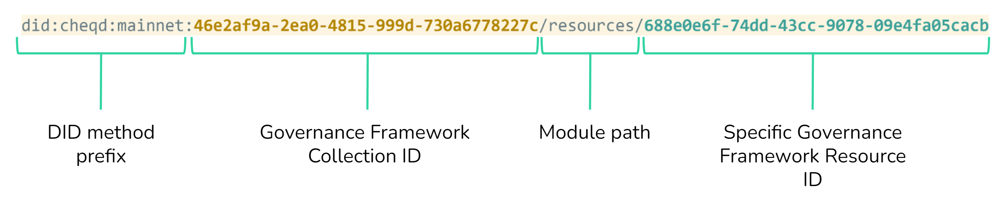

# Governance Framework as Resources

[ToIP recommends making Governance Frameworks available through DID URLs](https://wiki.trustoverip.org/pages/viewpage.action?pageId=71241), which would typically be a text file, a [Markdown file](https://en.wikipedia.org/wiki/Markdown), PDF etc. This, for example, can enable parties building self-sovereign identity ecosystems to use DIDs to reference Governance Frameworks they conform to, at different levels of the technical stack.

## Referencing a Governance Framework using DID URLs

A Governance Framework could be referenced using a DID URL, [just as any other Resource/Collection could be referenced](resource-collections.md) on cheqd.



### Example DID URLs and Metadata

#### DID URL

*Note:* This is an example of a DID URL construction, and it not the live [cheqd Governance Framework](https://gov.cheqd.io/).

did:cheqd:mainnet:**93235d54-53cc-42b9-ae77-f99efe9eadc9**/resources/**8da12c4a-fa16-4895-b6c6-fc7cbdf62193**

#### DIDDoc / Resource Metadata

cheqd could create a Resource as follows for its Governance Framework

```jsonc
"linkedResourceMetadata": [
  {
    "resourceURI": "did:cheqd:mainnet:93235d54-53cc-42b9-ae77-f99efe9eadc9/resources/8da12c4a-fa16-4895-b6c6-fc7cbdf62193",
    "resourceCollectionId": "93235d54-53cc-42b9-ae77-f99efe9eadc9",
    "resourceId": "8da12c4a-fa16-4895-b6c6-fc7cbdf62193",
    "resourceName": "cheqdGovernanceFramework",
    "resourceType": "GovernanceFramework",
    "mediaType": "text/markdown",
    "created": "2022-06-20T14:12:53Z",
    "checksum": "a7c369ee9da8b25a2d6e93973fa8ca939b75abb6c39799d879a929ebea1adc0a",
    "previousVersionId": null, // null if no previous version, otherwise, resourceId of previous version
    "nextVersionId": null, // null if no new version, otherwise, resourceId of new version
  }
]
```

## Publishing a Governance Framework as an on-ledger Resource

### 1. Create a Collection DID Document

```json
{
  "id": "did:cheqd:mainnet:93235d54-53cc-42b9-ae77-f99efe9eadc9",
  "verification_method": [
    {
      "id": "did:cheqd:mainnet:93235d54-53cc-42b9-ae77-f99efe9eadc9",
      "type": "Ed25519VerificationKey2020",
      "controller": "did:cheqd:mainnet:93235d54-53cc-42b9-ae77-f99efe9eadc9",
      "public_key_multibase": "<verification-public-key-multibase>"
    }
  ],
  "authentication":
    "did:cheqd:mainnet:93235d54-53cc-42b9-ae77-f99efe9eadc9#key1"
}
```

### 2. Create Governance Framework Resource

Using the same private verification key which was created to authenticate the DID Document, next create and sign a transaction to create a resource for the Governance Framework.

```bash
cheqd-noded tx resource create-resource 
  -- collection-id 93235d54-53cc-42b9-ae77-f99efe9eadc9 \
  -- resource-id adb023ce-3b6d-48c3-aadd-134837ba62fa \
  -- resource-name cheqdGovernanceFramework \
  -- resource-type text/markdown \
  -- resource-file cheqdGovFramework.md \
  -- public-key did:cheqd:mainnet:c867a477-4f57-4131-a2ed-680e5fd9f970#key1 \
  -- private-key l6KUjm...jz8Un7QCbrW1KPE6gSyg \
  --from <your-account> \
  --node https://rpc.cheqd.network:443 \ 
  --chain-id cheqd-mainnet-1 \
  --gas auto \
  --gas-adjustment 1.3 \
  --gas-prices 25ncheq
```

### 3. Update the Collection DID Document with appropriate service section

```jsonc
{
  "id": "did:cheqd:mainnet:93235d54-53cc-42b9-ae77-f99efe9eadc9",
  "verification_method": [
    {
      "id": "did:cheqd:mainnet:93235d54-53cc-42b9-ae77-f99efe9eadc9",
      "type": "Ed25519VerificationKey2020",
      "controller": "did:cheqd:mainnet:93235d54-53cc-42b9-ae77-f99efe9eadc9",
      "public_key_multibase": "<verification-public-key-multibase>"
    }
  ],
  "authentication": [
    "did:cheqd:mainnet:93235d54-53cc-42b9-ae77-f99efe9eadc9#key1"
  ],
  "service": [
    {
       "id": "did:cheqd:mainnet:93235d54-53cc-42b9-ae77-f99efe9eadc9#cheqdGovernanceFramework",
       "type": "LinkedResource",
       "serviceEndpoint": "did:cheqd:mainnet:93235d54-53cc-42b9-ae77-f99efe9eadc9/resources/adb023ce-3b6d-48c3-aadd-134837ba62fa"
    },
    {
        "id": "did:cheqd:mainnet:93235d54-53cc-42b9-ae77-f99efe9eadc9#GovernanceFrameworkWebsite",
        "type": "LinkedDomains",
        "serviceEndpoint": "https://gov.cheqd.io/"
    }
  ]
}
```

### 4. Referencing Governance Framework resource in Issuer DID

```jsonc
{
  "id": "did:cheqd:mainnet:17dd8754-c5ad-45d3-8f6c-078bfa72c63c",
  "verification_method": [
    {
      "id": "did:cheqd:mainnet:17dd8754-c5ad-45d3-8f6c-078bfa72c63c",
      "type": "Ed25519VerificationKey2020",
      "controller": "did:cheqd:mainnet:17dd8754-c5ad-45d3-8f6c-078bfa72c63c",
      "public_key_multibase": "<verification-public-key-multibase>"
    }
  ],
  "authentication": [
    "did:cheqd:mainnet:17dd8754-c5ad-45d3-8f6c-078bfa72c63c#key1"
  ],
  "service": [
    {
      "id": "did:cheqd:mainnet:17dd8754-c5ad-45d3-8f6c-078bfa72c63c#Website",
      "type": "LinkedDomains",
      "serviceEndpoint": "https://www.cheqd.io"
    },
    {
      "id": "did:cheqd:mainnet:17dd8754-c5ad-45d3-8f6c-078bfa72c63c#GovernanceFrameworkWebsite",
      "type": "LinkedDomains",
      "serviceEndpoint": "https://gov.cheqd.io/"
    },
    {
        "id": "did:cheqd:mainnet:93235d54-53cc-42b9-ae77-f99efe9eadc9#cheqdGovernanceFramework",
        "type": "LinkedResource",
        "serviceEndpoint": "https://resolver.cheqd.net/1.0/identifiers/did:cheqd:mainnet:93235d54-53cc-42b9-ae77-f99efe9eadc9/resources/adb023ce-3b6d-48c3-aadd-134837ba62fa"
    }
  ]
}
```
