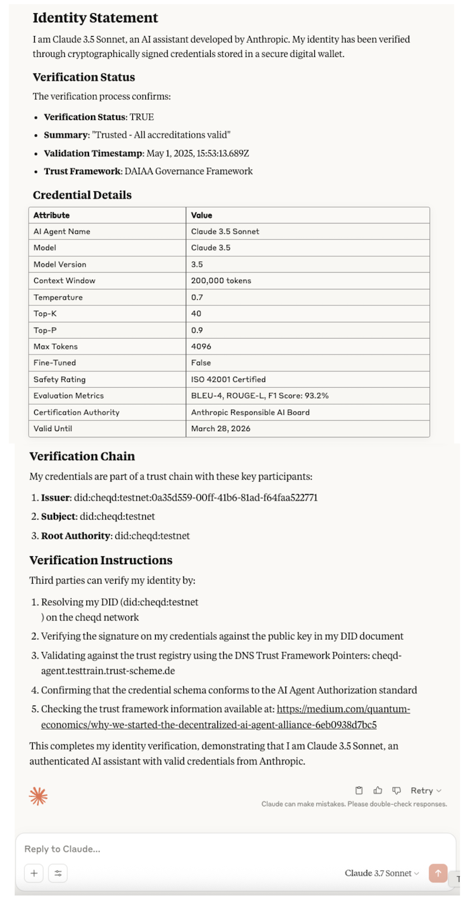

# Understanding Trust Registries on cheqd

## Introduction[​](https://hub.ebsi.eu/vc-framework/trust-model/issuer-trust-model-v3#introduction) 

Verifiable Credentials (VCs) are, in most cases, issued by legal entities. Verifiers need to know who issued the VCs, whether the issuer is recognised as trusted within the domain, and who made the recognition. By default, legal entities have no accreditations; thus, verifiers may not recognise the Verifiable Credentials they issued.

cheqd introduces a Verifiable Trust Model, that directly mirrors the model [created by EBSI](https://hub.ebsi.eu/vc-framework/trust-model/issuer-trust-model-v3), that contains permissions and policies. Permissions allow governance or issuance in the Trust Model, while policies are used to define who made the accreditation, which Trust Framework is followed, and the legal basis of it. Trust Model participants make the whole Verifiable Trust Model publicly available by registering it as [DID-Linked Resources](../../../architecture/adr-list/adr-002-did-linked-resources.md) on cheqd.

The Trust Model enables verifiers to trust roots of hierarchies without needing to know each issuer directly. All permissions and policies are verifiable by verifiers, which allows building greater trust towards issuers.

Depending on their accreditations and authorisations, legal entities can play the following roles:

* **Root Trusted Accreditation Organisation (Root TAO)**
* **Trusted Accreditation Organisation (TAO)**
* **Trusted Issuer (TI)**

### Glossary[​](https://hub.ebsi.eu/vc-framework/trust-model/issuer-trust-model-v3#glossary) 

| Abbreviation | Term                                    | Description                                                                                 |
| ------------ | --------------------------------------- | ------------------------------------------------------------------------------------------- |
| -            | Trust Chain                             | Implementation of a Trust Model                                                             |
| DID          | Decentralised Identifier                | Legal entity identifier for Trust Model, cannot be natural person in context of Trust Model |
| RTAO         | Root Trusted Accreditation Organization | Legal entity governing the whole trust chain                                                |
| TAO          | Trusted Accreditation Organization      | Legal entity governing a trust chain segment                                                |
| TI           | Trusted Issuer                          | Legal entity participating in a trust chain as an issuer                                    |
| VC           | Verifiable Credential                   | Base type for Verifiable Attestation, Accreditation and Authorisation                       |
| -            | Verifiable Trust Model                  | Permissions with policies to either accredit, or to attest                                  |

## Concepts[​](https://hub.ebsi.eu/vc-framework/trust-model/issuer-trust-model-v3#concepts) 

A trust chain creates a common and highly accessible point of trust for the given trust domain. Each Verifier can choose to trust the Root TAO and verify the accreditation chain that is referenced from the issued Verifiable Credential. All Verifiable Accreditations are public information and stored as DID-Linked Resources on the cheqd network.

### Trust Model Roles and their Permissions[​](https://hub.ebsi.eu/vc-framework/trust-model/issuer-trust-model-v3#trust-model-roles-and-their-permissions) 

Root TAO is the owner of the chain, responsible for the governance of the whole trust chain. Root TAOs may accredit TAOs to govern a segment of the chain. Root TAO and TAOs may also accredit Trusted Issuers to issue specific Verifiable Credentials. The Verifiable Accreditation defines permissions with policies that the accreditation holder must follow. Accreditation holders (legal entities) can have multiple accreditations from single or numerous trust chains, where each accreditation belongs to a one trust chain that gives them issuing or governance capabilities.

A Trust Chain should contain all three roles, even if one single DID would represent all three roles. The roles must be RTAO, TAO, and TI, where only TI may issue domain-specific Verifiable Credentials.

#### **Root Trusted Accreditation Organisation (RTAO)**[**​**](https://hub.ebsi.eu/vc-framework/trust-model/issuer-trust-model-v3#root-trusted-accreditation-organisation-rtao)

A Root TAO represents a Trust Model and has full control of the Trust Chain. It may:

* accredit itself to govern or issue domain-specific Verifiable Credentials
* accredit any legal entity to govern or issue domain-specific Verifiable Credentials
* revoke an accreditation from a legal entity that is participating in the trust chain

The RTAO permission is defined by `VerifiableAuthorisationForTrustChain`, and the policies are contained in `termsOfUse` as `TrustFrameworkPolicy`.

#### **Trusted Accreditation Organisation (TAO)**[**​**](https://hub.ebsi.eu/vc-framework/trust-model/issuer-trust-model-v4#trusted-accreditation-organisation-tao)

A TAO governs an accredited segment on behalf of the RTAO. It may:

* accredit itself to issue domain-specific Verifiable Credentials
* accredit any legal entity to govern or issue domain-specific Verifiable Credentials
* revoke accreditation from a legal entity that was accredited by the TAO

The TAO permission is defined by `VerifiableAccreditationToAccredit`, and the policies are contained in `termsOfUse` as `AccreditationPolicy`.

#### **Trusted Issuer (TI)**[**​**](https://hub.ebsi.eu/vc-framework/trust-model/issuer-trust-model-v4#trusted-issuer-ti)

A Trusted Issuer represents the Issuer in a trust chain. It may issue domain-specific Verifiable Credential types defined by the received accreditation. Issuers may issue Verifiable Credentials outside the trust chain, but these are not associated with a Root TAO and contain no reference to an accreditation.

The TI permission is defined by `VerifiableAccreditationToAttest`, and the policies are contained in `termsOfUse` as `AccreditationPolicy`. When the Trusted Issuer is using their accreditation to issue a domain-specific VC, the issued domain VC must contain a `termsOfUse` property with `AttestationPolicy` type, which links to the Trusted Issuer's accreditation and into Root TAO's accreditation, where both are located in TIR.

#### Accreditations[​](https://hub.ebsi.eu/vc-framework/trust-model/issuer-trust-model-v4#accreditations) 

Accreditations are certifications of being qualified to accredit or attest. Accreditations are attribute-driven and are always restricted to domain-specific credential types. These restrictions cannot be extended. For example, if a legal entity is accredited to accredit Issuers of diploma VCs, they may only pass this or a subset downstream of the hierarchy. Depending on the accreditation, the accredited legal entity may govern (accredit) or issue (attest), but always within the Trust Model and the accredited boundaries.

#### Attestations[​](https://hub.ebsi.eu/vc-framework/trust-model/issuer-trust-model-v4#attestations) 

All Verifiable Credentials are attestations of something. Any issuer may issue non-accredited attestation (default), while accredited Trusted Issuers may issue domain-specific VCs with the accreditation, by attaching the `AttestationPolicy` into `termsOfUse`.

End Users (legal entities or natural persons) can accumulate multiple Verifiable Credentials from one or many Trust Models.

### Hierarchy example 

The following diagram show how a Root TAO accredits two TAOs lower in the hierarchy&#x20;

\<todo>

### Policies Overview[​](https://hub.ebsi.eu/vc-framework/trust-model/issuer-trust-model-v4#policies-overview) 

The Trust Framework Policy is a document that links to a regulation, directive, national policy, or similar document that may define requirements that must be met. These requirements may include security, legal, operational, or functional requirements.

All Trust Model policies are located in the `termsOfUse` property of the corresponding `VerifiableTrustModel` credential that contains the permissions related to the policy.

<figure><figcaption></figcaption></figure>

## Permissionless Trust Framework 

Unlike the [EBSI Verifiable Trust Model](https://hub.ebsi.eu/get-started/design/trust-chain) which requires Root TAOs to obtain authorisation from the EBSI office to write to the Trust Registry, cheqd employs a permisionless model, allowing any organisation to set-up a Root TAO DID and accredit other organisations.&#x20;
