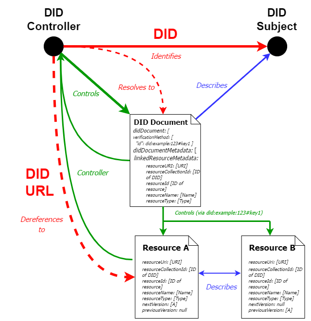

# Understanding DID-Linked Resources

## Overview

Our objective in building DID-Linked Resources on cheqd is to **improve the way resources are stored, referenced and retrieved for our partners and the broader SSI community,** in line with the existing [W3C DID Core standard](https://www.w3.org/TR/did-core/).

## Contents

<table data-view="cards"><thead><tr><th></th><th></th><th data-hidden data-card-target data-type="content-ref"></th></tr></thead><tbody><tr><td><mark style="color:blue;"><strong>Context for developing DID-Linked Resources</strong></mark></td><td>Understand the rationale for creating DID-Linked Resources and how they improve the current paradigm.</td><td><a href="context.md">context.md</a></td></tr><tr><td><mark style="color:blue;"><strong>Technical composition of DID-Linked Resources</strong></mark></td><td>Understand the requirements and technical composition for DID-Linked Resources.</td><td></td></tr><tr><td><mark style="color:blue;"><strong>Referencing DID-Linked Resources in VCs</strong></mark></td><td>Learn how to embed DID-Linked Resources into the body of credentials for different purposes.</td><td></td></tr></tbody></table>

## Architecture for DID-Linked Resources

If you are interested in diving into the full architectural decisions for DID-Linked Resources, head to our ADR and the emerging W3C specification.

<table data-card-size="large" data-view="cards"><thead><tr><th></th><th></th><th data-hidden data-card-target data-type="content-ref"></th></tr></thead><tbody><tr><td><mark style="color:blue;"><strong>ADR 002: DID-Linked Resources</strong></mark></td><td>Read up on the full architectural considerations and decisions that went into the initial design of DID-Linked Resources</td><td><a href="../../../architecture/adr-list/adr-002-did-linked-resources.md">adr-002-did-linked-resources.md</a></td></tr><tr><td><mark style="color:blue;"><strong>W3C DID-Linked Resources</strong></mark></td><td>Keep up to date with the formal standardisation of DID-Linked Resources at the World Wide Web Consortium (W3C).</td><td><a href="https://w3c-ccg.github.io/DID-Linked-Resources/">https://w3c-ccg.github.io/DID-Linked-Resources/</a></td></tr></tbody></table>

As a general architectural overview for DID-Linked Resources, see the diagram below:

<figure><figcaption></figcaption></figure>

## Support for AnonCreds using DID-Linked Resources

One of the functions of DID-Linked Resources is enabling support for AnonCreds on cheqd, where previously these were tied into the Hyperledger Indy ecosystem. Take a look at our AnonCreds documentation here:

<table data-card-size="large" data-view="cards"><thead><tr><th></th><th></th><th data-hidden data-card-target data-type="content-ref"></th></tr></thead><tbody><tr><td><mark style="color:blue;"><strong>cheqd AnonCreds Object Method</strong></mark></td><td>Understand how cheqd supports AnonCreds natively on its ledger, and start issuing and verifying AnonCreds using our supported SDKs.</td><td><a href="../../../advanced/anoncreds/">anoncreds</a></td></tr></tbody></table>
