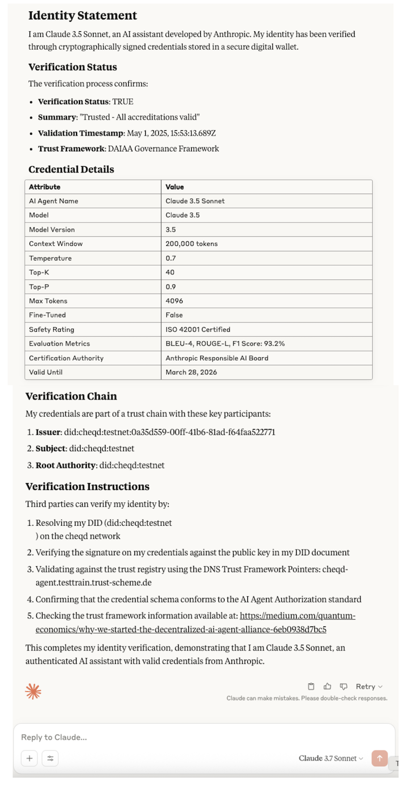

---
layout:
  title:
    visible: true
  description:
    visible: true
  tableOfContents:
    visible: true
  outline:
    visible: true
  pagination:
    visible: true
---

# Decentralized Trust Chains (DTCs)

## Introduction[​](https://hub.ebsi.eu/vc-framework/trust-model/issuer-trust-model-v3#introduction) 

Verifiable Credentials (VCs) are, in most cases, issued by legal entities. The purpose of Verifiable Credentials is to provide the Relying Party that receives the credentials a Level of Assurance (LoA) that the attributes and claims within the credential are legitimate. However, it is **not currently easy to determine whether a legal entity issuing a credential is in fact the entity they claim to be**, and not, a fraudulent misrepresentation of that legal entity. This is the challenge that Trust Infrastructure and Trust Registries are positioned to solve.


Note: This **Trust Registry challenge is a significant problem** for the digital credential industry, and often inhibits the technology reaching a production stage of readiness.


At present, legal entities that issue credentials have no mechanism to establish that they are trustworthy; thus, Relying Parties may not recognise the DIDs signing the Verifiable Credentials they receive. To fully establish trust, Relying Parties need to know _**who**_ issued the VCs, whether the _**issuer is recognised**_ _**as trusted**_ within a particular governance framework, and _**who accredited the issuer for the purpose of issuing the credential**_.&#x20;

To solve this industry-wide challenge, cheqd introduces a **Verifiable Trust Infrastructure "Decentralzied Trust Chains (DTCs)"**, that directly complements the model [created by EBSI](https://hub.ebsi.eu/vc-framework/trust-model/issuer-trust-model-v3). Within Decentralized Trust Chains, users can create hierarchical chains of trust "**Trust Chains"** that together encapsulate a "**Trust Registry"** for a given ecosystem.

The Trust Infrastructure Model also includes **permissions and policies** set via "**Verifiable Accreditations**" and an overall "**Governance Framework**". Herein, permissions govern the scope of , while policies are used to define who made the accreditation; which Trust Framework is followed; and, the legal basis of the credential.&#x20;

cheqd Trust Infrastructure users **make the whole Verifiable Trust Model publicly available by registering it as a collection of** [**DID-Linked Resources**](../../../architecture/adr-list/adr-002-did-linked-resources.md) on cheqd. cheqd's Trust Infrastructure therefore enables verifiers to automatically resolve and establish trust in hierarchies of trust without needing to know each organisation directly, using industry-standard resolution mechanisms defined in the W3C DID-Core and the DID Resolution Spec.

## Glossary[​](https://hub.ebsi.eu/vc-framework/trust-model/issuer-trust-model-v3#glossary) 

There are many terms used within this guide, and as such, familiarise yourself or refer back to the concepts within the glossary below:

| Abbreviation | Term                                    | Description                                                                                                                                   |
| ------------ | --------------------------------------- | --------------------------------------------------------------------------------------------------------------------------------------------- |
| -            | Accreditation Policy                    | Part of a Verifiable Credential, using the `termsOfUse` section to reference the parentAccreditation in the Trust Chain                       |
| DID          | Decentralized Identifier                | Legal entity identifier for Trust Registry, cannot be natural person in context of Trust Infrastructure                                       |
| GA           | Governance Authority                    | The legal entity or consortia responsible for writing the Governance Framework. In many instances the Governance Authority is also a Root TAO |
| GF           | Governance Framework                    | A policy document outlining the purpose, roles, scopes and permissions for a given ecosystem using the Trust Infrastructure.                  |
| Root TAO     | Root Trusted Accreditation Organization | Legal entity governing the whole trust chain                                                                                                  |
| TAO          | Trusted Accreditation Organization      | Legal entity governing a trust chain segment                                                                                                  |
| -            | Trust Chain                             | Hierarchy of Verifiable Accreditations. Multiple Trust Chains may comprise a Trust Registry.                                                  |
| TI           | Trusted Issuer                          | Legal entity participating in a trust chain as an issuer                                                                                      |
| -            | Trust Infrastructure                    | The overall set of technical and governance components to establish end-to-end trust.                                                         |
| -            | Verifiable Accreditation                | Type of on-ledger Verifiable Credential that is specifically used for establishing governance permissions and policies                        |
| -            | Verifiable Trust Model                  | Permissions with policies to either accredit, or to attest                                                                                    |

## Establishing a Trust Hierarchy 

The Decentralized Trust Chain model is predicated on the notion of a trust hierarchy, which is conceptually very similar to traditional Public Key Infrastructure (PKI). Specifically, the model relies on a **Root of Trust** from which trusted relationships can be established.

In our model, each organisation in the trust hierarchy possesses a Decentralized Identifier (DID) and is able to issue Verifiable Accreditations to other entities, conveying a set of permissions or scopes that determine what the recipient entity is permitted to do.&#x20;

The following diagram show how a Root TAO accredits two TAOs lower in the hierarchy:

<figure><figcaption></figcaption></figure>

where:

* **Root of Trust (rTAO) DID:**
  * Controls Verifiable Accreditations (VAs) issued from rTAO to TAOs.
* **Trusted Accreditation Organisation (TAO) DID:**
  * Controls Verifiable Accreditations (VAs) issued from TAOs to Trusted Issuers or subTAOs.&#x20;
* **Trusted Issuer DID:**
  * Issues Verifiable Credentials with Issuance Policies
* **Verifiable Credentials**
  * Issued including the Issuance Policies in the `TermsOfUse` section of the data model.
  * Issued to Digital Identity Wallet of user or organisation, which can be later verified up the entire trust chain.

## Trust Infrastructure Roles and their Permissions 

As shown in the diagram above, legal entities can play the following roles:

* **Root Trusted Accreditation Organisation (Root TAO)**
* **Trusted Accreditation Organisation (TAO)**
* **Trusted Issuer (TI)**

A Trust Chain should contain all three roles, even if one single DID would represent all three roles. The roles must be RTAO, TAO, and TI, where only TI may issue domain-specific Verifiable Credentials.

### **Root Trusted Accreditation Organisation (RTAO)**

The **Root TAO** is the owner of a **Trust Chain**, responsible for the **governance of the whole Trust Chain**. Root TAOs may:

* accredit itself to govern or issue domain-specific Verifiable Credentials
* accredit TAOs to govern a segment of the Trust Chain
* accredit a Trusted Issuer to issue domain-specific Verifiable Credentials
* revoke an accreditation from a legal entity that is participating in the Trust Chain

The RTAO permission is defined by `VerifiableAuthorisationForTrustChain`, and the policies are contained in `termsOfUse` as `TrustFrameworkPolicy`.

<table data-card-size="large" data-view="cards"><thead><tr><th></th><th></th><th data-hidden data-card-target data-type="content-ref"></th></tr></thead><tbody><tr><td><mark style="color:blue;"><strong>RTAO -> TAO</strong></mark></td><td>Learn about how Root TAOs can accredit other TAOs in the trust ecosystem with permissions and Trust Framework Policies.</td><td><a href="rtao-to-tao.md">rtao-to-tao.md</a></td></tr></tbody></table>

### **Trusted Accreditation Organisation (TAO)**[**​**](https://hub.ebsi.eu/vc-framework/trust-model/issuer-trust-model-v4#trusted-accreditation-organisation-tao)

A TAO governs an accredited segment on behalf of the RTAO. It may:

* accredit itself to issue domain-specific Verifiable Credentials
* accredit another TAO to govern a segment of the Trust Chain
* accredit a Trusted Issuer to issue domain-specific Verifiable Credentials
* revoke accreditation from a legal entity that was accredited by the TAO

The TAO permission is defined by `VerifiableAccreditationToAccredit`, and the policies are contained in `termsOfUse` as `AccreditationPolicy`.

<table data-card-size="large" data-view="cards"><thead><tr><th></th><th></th><th data-hidden data-card-target data-type="content-ref"></th></tr></thead><tbody><tr><td><mark style="color:blue;"><strong>TAO -> SubTAO</strong></mark></td><td>Learn about how TAOs can accredit other SubTAOs in the trust ecosystem with permissions and Accreditation Policies.</td><td><a href="tao-to-subtao.md">tao-to-subtao.md</a></td></tr><tr><td><mark style="color:blue;"><strong>TAO - TI</strong></mark></td><td>Learn about how TAOs can accredit Trusted Issuers to issue credentials within the trust ecosystem, using permissions and Accreditation Policies.</td><td><a href="tao-to-ti.md">tao-to-ti.md</a></td></tr></tbody></table>

### **Trusted Issuer (TI)**[**​**](https://hub.ebsi.eu/vc-framework/trust-model/issuer-trust-model-v4#trusted-issuer-ti)

A Trusted Issuer represents the Issuer in a Trust Chain. It may issue domain-specific Verifiable Credential types defined by the received accreditation.&#x20;


Note that issuers may issue Verifiable Credentials outside the Trust Chain, but these are not associated or recognised by a Root TAO and therefore contain no weight within the Trust Chain's governance framework.


The TI permission is defined by `VerifiableAccreditationToAttest`, and the policies are contained in `termsOfUse` as `AccreditationPolicy`. When the Trusted Issuer is using their accreditation to issue a domain-specific VC, the issued domain VC must contain a `termsOfUse` property with `AttestationPolicy` type, which links to the Trusted Issuer's accreditation and into Root TAO's accreditation, where both are located in TIR.

<table data-card-size="large" data-view="cards"><thead><tr><th></th><th></th><th data-hidden data-card-target data-type="content-ref"></th></tr></thead><tbody><tr><td><mark style="color:blue;"><strong>Referencing Trust Registry within a Verifiable Credential</strong></mark></td><td>Learn how a Trusted Issuer can reference a Trust Registry in an issued credential, enabling a relying party to traverse the Trust Chain.</td><td><a href="vc-referencing.md">vc-referencing.md</a></td></tr></tbody></table>

## Policies Overview[​](https://hub.ebsi.eu/vc-framework/trust-model/issuer-trust-model-v4#policies-overview) 

The **Governance Framework Policy** is a document, written by a **Governance Authority**,  that defines requirements that must be met for the Trust Ecosystem. These requirements may include security, legal, operational, or functional requirements and may relate to regulation, directives, national policy, or similar documents.

All Trust Model policies are located in the `termsOfUse` property of the corresponding  Accreditation or credential that contains the permissions related to the policy.

<figure><figcaption></figcaption></figure>

### Trust Types[​](https://hub.ebsi.eu/vc-framework/trust-model/issuer-trust-model-v3#concepts) 

#### Accreditations[​](https://hub.ebsi.eu/vc-framework/trust-model/issuer-trust-model-v4#accreditations) 

Accreditations are certifications of being qualified to accredit or attest. Accreditations are attribute-driven and are always restricted to domain-specific credential types. These restrictions cannot be extended. For example, if a legal entity is accredited to accredit Issuers of diploma VCs, they may only pass this or a subset downstream of the hierarchy. Depending on the accreditation, the accredited legal entity may govern (accredit) or issue (attest), but always within the Trust Model and the accredited boundaries.

Each Verifiable Accreditation is also associated with an `AccreditationPolicy` in the `termsOfUse` section of the credential. This Policy links to the parent or root accreditation to enable verifiers to traverse the trust registry.&#x20;

#### Credentials[​](https://hub.ebsi.eu/vc-framework/trust-model/issuer-trust-model-v4#attestations) 

All Verifiable Credentials are attestations of something. Any issuer may issue credentials (default), while accredited Trusted Issuers may issue domain-specific VCs with the accreditation, by attaching the `AttestationPolicy` into `termsOfUse`.

End Users (legal entities or natural persons) can accumulate multiple Verifiable Credentials from one or many Trust Models.
