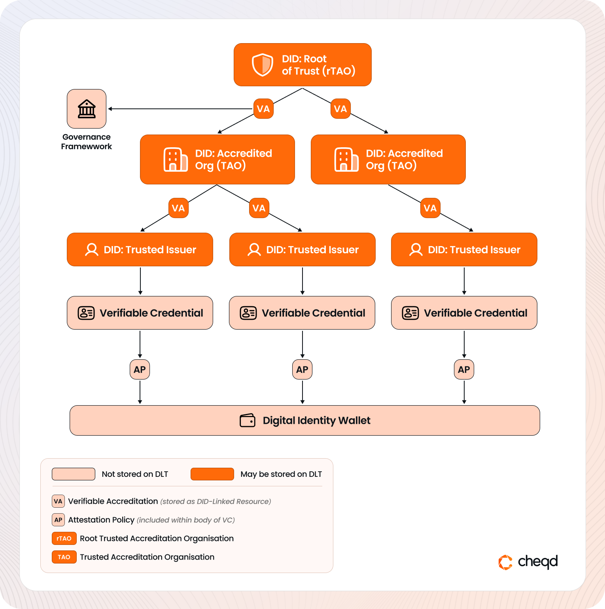

# Decentralized Trust Chains (DTCs)

## Introduction[​](https://hub.ebsi.eu/vc-framework/trust-model/issuer-trust-model-v3#introduction) 

Verifiable Credentials (VCs) are most commonly issued by legal entities to assert facts such as identity, qualifications, or authorisation. Their core purpose is to provide the **Relying Party** — the entity verifying the credential — with a **Level of Assurance (LoA)** that the claims within the credential are legitimate.

However, in practice, it’s often difficult for relying parties to determine whether a legal entity issuing a credential is **authentic**, or a **fraudulent impersonation**. There is no built-in mechanism in most credential ecosystems for verifying whether a DID-based issuer is recognised, authorised, or trustworthy.


Note: This lack of trusted issuer infrastructure is a critical blocker for many digital credential ecosystems — and a common reason why solutions stall before reaching production.


To fully establish trust, relying parties must be able to:

* Identify **who issued** a credential
* Understand **whether the issuer was authorised** to issue it
* Trace **who accredited the issuer**, and under what governance framework

### Introducing Decentralized Trust Chains (DTCs)

To solve this challenge, **cheqd** introduces a v**erifiable trust infrastructure** called **Decentralized Trust Chains (DTCs)** — a model that complements and extends approaches like the **EBSI Trust Chain Framework**.

DTCs allow participants to create **hierarchical chains of trust**, where:

* A **Root Trusted Accreditation Organisation (rTAO)** defines the governance model
* **Verifiable Accreditations** delegate authority to other legal entities (e.g., TAOs, Trusted Issuers)
* **Verifiable Credentials** are issued by accredited issuers, with embedded metadata that references the trust chain

Together, these components form a **decentralized trust registry** for each ecosystem.

### Publicly Verifiable, Policy-Governed Trust

cheqd’s DTC model introduces both **permissions** and **policies**:

* **Permissions** define what an entity is allowed to do (e.g. issue or accredit)
* **Policies** define **who granted that permission**, under what framework, and with what legal or operational requirements.

This infrastructure is made **publicly resolvable** by publishing all authorisations and accreditations as **DID-Linked Resources** on the cheqd ledger. This means:

* 🧩 Trust relationships are **machine-verifiable**
* 🔍 Verifiers do not need prior knowledge of each entity
* 🛠️ Resolution follows W3C standards like **DID-Core, DID Resolution and DID-Linked Resources.**

The result: A scalable, cryptographically verifiable way to determine whether an issuer — and the credential they issue — can be trusted.

## Glossary[​](https://hub.ebsi.eu/vc-framework/trust-model/issuer-trust-model-v3#glossary) 

There are many terms used within this guide, and as such, familiarise yourself or refer back to the concepts within the glossary below:

| Abbreviation    | Term                                    | Description                                                                                                                                                                                                                                                                                                |
| --------------- | --------------------------------------- | ---------------------------------------------------------------------------------------------------------------------------------------------------------------------------------------------------------------------------------------------------------------------------------------------------------- |
| -               | Accreditation Policy                    | A machine-readable policy embedded in a **Verifiable Accreditation** that defines the scope, conditions, and governance under which an entity is authorised to accredit others or issue Verifiable Credentials.                                                                                            |
| -               | Attestation Policy                      | A machine-readable policy embedded in a **Verifiable Credential** that links the credential to the issuer’s accreditation and root authorisation, enabling verifiers to validate that the issuer was authorised to make the attestation.                                                                   |
| DID             | Decentralized Identifier                | Legal entity identifier for Trust Registry, cannot be natural person in context of Trust Infrastructure                                                                                                                                                                                                    |
| GA              | Governance Authority                    | The legal entity or consortia responsible for writing the Governance Framework. In many instances the Governance Authority is also a Root TAO                                                                                                                                                              |
| GF              | Governance Framework                    | A policy document outlining the purpose, roles, scopes and permissions for a given ecosystem using the Trust Infrastructure.                                                                                                                                                                               |
| Root TAO (rTAO) | Root Trusted Accreditation Organization | A **Root Trusted Accreditation Organisation (rTAO)** is the top-level authority in a Decentralized Trust Chain responsible for defining the governance framework and issuing the Root Authorisation that anchors all downstream accreditations and attestations within the trust ecosystem.                |
| TAO             | Trusted Accreditation Organization      | A **Trusted Accreditation Organisation (TAO)** is an entity accredited by a Root Trusted Accreditation Organisation (rTAO) or another TAO to govern a segment of the trust chain by issuing accreditations to other entities or authorising the issuance of Verifiable Credentials within a defined scope. |
| -               | Trust Chain                             | Hierarchy of Verifiable Accreditations. Multiple Trust Chains may comprise a Trust Registry.                                                                                                                                                                                                               |
| TI              | Trusted Issuer                          | A **Trusted Issuer** is an entity accredited within a Decentralized Trust Chain to issue domain-specific Verifiable Credentials, operating under the scope and governance defined by an upstream accreditation and the overarching trust framework.                                                        |
| -               | Trust Infrastructure                    | The overall set of technical and governance components to establish end-to-end trust.                                                                                                                                                                                                                      |
| -               | Verifiable Accreditation                | A **Verifiable Accreditation** is a Verifiable Credential that delegates authority from one entity to another, specifying the types of credentials they are permitted to issue or the roles they are authorised to perform within a defined trust framework.                                               |
| -               | Verifiable Trust Model                  | Permissions with policies to either accredit, or to attest                                                                                                                                                                                                                                                 |

## Establishing a Trust Hierarchy 

Decentralized Trust Chains are based on the concept of a **hierarchical trust model**, conceptually similar to traditional Public Key Infrastructure (PKI). At the top sits a **Root of Trust**, from which trust is delegated through a verifiable chain of credentials.

In this model, each participant is identified by a **Decentralized Identifier (DID)** and may be granted permission — via a Verifiable Accreditation — to accredit others or issue credentials themselves.

### How the Hierarchy Works

Trust is delegated top-down through **Verifiable Accreditations**:

| Role                                         | Description                                                                                              |
| -------------------------------------------- | -------------------------------------------------------------------------------------------------------- |
| **Root TAO (rTAO)**                          | Issues Root Authorisations and initial Accreditations to other TAOs. Sets the governance baseline.       |
| **Trusted Accreditation Organisation (TAO)** | Can accredit other TAOs or Trusted Issuers. Acts as an intermediary layer in larger ecosystems.          |
| **Trusted Issuer (TI)**                      | Issues **Verifiable Credentials** to users/entities, based on permissions received from an upstream TAO. |

The following diagram show how a Root TAO accredits two TAOs lower in the hierarchy:

<figure><figcaption>
Hierarchical Decentralized Trust Chain architecture on cheqd
</figcaption></figure>

Each role is cryptographically linked through issued Verifiable Credentials, creating a **machine-verifiable trust path**.

### Verifiable Credentials & Policy Enforcement

* **Credentials** are issued with a `termsOfUse` section that references an **Attestation Policy**, linking them back to the issuer’s accreditation and the root of trust.
* **Digital Wallets** or agents can present these credentials for verification.
* **Verifiers** can then resolve and validate the entire trust chain — from the issuer to the rTAO — using DID resolution and optional DNS anchoring.

## Trust Infrastructure Roles and their Permissions 

As shown in the diagram above, legal entities can play the following roles:

*   In a Decentralized Trust Chain, each legal entity assumes a defined role with clearly scoped permissions. While a single DID may represent multiple roles in simple ecosystems, every complete trust chain should include these three functional roles:

    * **Root Trusted Accreditation Organisation (rTAO)**
    * **Trusted Accreditation Organisation (TAO)**
    * **Trusted Issuer (TI)**

    Only the **Trusted Issuer (TI)** is permitted to issue domain-specific Verifiable Credentials (VCs).

### **Root Trusted Accreditation Organisation (rTAO)**

The **rTAO** is the root of governance in a trust chain. It establishes the ecosystem’s rules and authorises who can issue or accredit within it.

**Capabilities:**

* Issue a **Root Authorisation** that defines the Trust Framework
* Self-accredit for governance or issuance
* Accredit TAOs and TIs to delegate responsibility
* Revoke accreditations from any participant in the trust chain

**Credential Type:**

* `VerifiableAuthorisationForTrustChain`

**Policy Type:**

* `TrustFrameworkPolicy` (included in `termsOfUse`)

<table data-card-size="large" data-view="cards"><thead><tr><th></th><th></th><th data-hidden data-card-target data-type="content-ref"></th></tr></thead><tbody><tr><td><mark style="color:blue;"><strong>Root Authorisations</strong></mark></td><td>Learn how Root TAOs can set the governance baseline, including the governance framework for the trust chain through Root Authorisations.</td><td><a href="root-authorisations.md">root-authorisations.md</a></td></tr><tr><td><mark style="color:blue;"><strong>RTAO -> TAO</strong></mark></td><td>Learn about how Root TAOs can accredit other TAOs in the trust ecosystem with permissions and Trust Framework Policies.</td><td><a href="rtao-to-tao.md">rtao-to-tao.md</a></td></tr></tbody></table>

### **Trusted Accreditation Organisation (TAO)**[**​**](https://hub.ebsi.eu/vc-framework/trust-model/issuer-trust-model-v4#trusted-accreditation-organisation-tao)

A **TAO** manages a delegated segment of the trust chain under the rTAO. It may further accredit entities or take on the role of issuer if permitted.

**Capabilities:**

* Accredit itself to issue VCs
* Accredit other TAOs or Trusted Issuers
* Revoke accreditations issued within its scope

**Credential Type:**

* `VerifiableAccreditationToAccredit`

**Policy Type:**

* `AccreditationPolicy` (included in `termsOfUse`)

<table data-card-size="large" data-view="cards"><thead><tr><th></th><th></th><th data-hidden data-card-target data-type="content-ref"></th></tr></thead><tbody><tr><td><mark style="color:blue;"><strong>TAO -> SubTAO</strong></mark></td><td>Learn about how TAOs can accredit other SubTAOs in the trust ecosystem with permissions and Accreditation Policies.</td><td><a href="tao-to-subtao.md">tao-to-subtao.md</a></td></tr><tr><td><mark style="color:blue;"><strong>TAO - TI</strong></mark></td><td>Learn about how TAOs can accredit Trusted Issuers to issue credentials within the trust ecosystem, using permissions and Accreditation Policies.</td><td><a href="tao-to-ti.md">tao-to-ti.md</a></td></tr></tbody></table>

### **Trusted Issuer (TI)**[**​**](https://hub.ebsi.eu/vc-framework/trust-model/issuer-trust-model-v4#trusted-issuer-ti)

A **Trusted Issuer** is an entity that issues domain-specific Verifiable Credentials under the conditions granted by its accreditation.

**Capabilities:**

* Issue Verifiable Credentials to users or organisations
* Only within the types, schemas, and jurisdictions defined in their accreditation

**Credential Type:**

* `VerifiableAccreditationToAttest`

**Policy Type:**

* `AccreditationPolicy` (accreditation) +\
  `AttestationPolicy` (included in the issued credential’s `termsOfUse`)

<table data-card-size="large" data-view="cards"><thead><tr><th></th><th></th><th data-hidden data-card-target data-type="content-ref"></th></tr></thead><tbody><tr><td><mark style="color:blue;"><strong>Referencing Trust Registry within a Verifiable Credential</strong></mark></td><td>Learn how a Trusted Issuer can reference a Trust Registry in an issued credential, enabling a relying party to traverse the Trust Chain.</td><td><a href="referencing-in-credential.md">referencing-in-credential.md</a></td></tr></tbody></table>

## Policies Overview[​](https://hub.ebsi.eu/vc-framework/trust-model/issuer-trust-model-v4#policies-overview) 

Policies define the **rules, permissions, and governance bindings** for each layer of the trust chain. They are embedded into credentials via the `termsOfUse` field and fall into three types:

| Policy Type              | Used In                  | Purpose                                                                     |
| ------------------------ | ------------------------ | --------------------------------------------------------------------------- |
| **TrustFrameworkPolicy** | Root Authorisation       | Defines the root governance model                                           |
| **AccreditationPolicy**  | Verifiable Accreditation | Constrains and describes the scope of authority                             |
| **AttestationPolicy**    | Verifiable Credential    | Links the credential back to the issuer’s accreditation and trust framework |

### How Policies are Linked

* **Root Authorisation** includes a `TrustFrameworkPolicy`
* **Each Accreditation** must reference:
  * A parent `AccreditationPolicy`, or
  * The original `TrustFrameworkPolicy`
* **Each Credential (Attestation)** must reference:
  * The `AttestationPolicy` pointing back to the issuer’s accreditation

<figure><figcaption>
Diagram showing different policy relationships in the trust chain
</figcaption></figure>

This layered policy model enables verifiers to **traverse and validate the entire trust chain** — from a single credential back to a rTAO (optionally anchored in DNS) — while ensuring that all participants adhere to consistent governance and operational standards.

## Trust Types in Decentralized Trust Chains

Trust Chains are constructed from three verifiable building blocks:

### 1. **Authorisations**

* Define the rules of the ecosystem
* Issued by the rTAO as a `VerifiableAuthorisationForTrustChain`
* Reference the root governance framework

### 2. **Accreditations**

* Grant permission to accredit or issue
* Are always domain-specific and non-transferable
* Must include an `AccreditationPolicy` in `termsOfUse`
* Allow entities to govern or issue **only** within the authorised scope

### 3. **Credentials (Attestations)**

* Assert facts (identity, qualifications, rights)
* Must include an `AttestationPolicy` that:
  * Links back to the issuer's accreditation
  * Establishes a trust path to the root authority
* Issuable only by **accredited Trusted Issuers**

#### In Summary:

| **Element**                    | **Purpose**                                                            |
| ------------------------------ | ---------------------------------------------------------------------- |
| **Authorisations**             | Define the governance and policy rules at the root of the trust chain  |
| **Accreditations**             | Delegate trust authority for accreditation or credential issuance      |
| **Credentials (Attestations)** | Assert verifiable facts within the scope of a governed trust framework |

## Get Started

## Get started

Use **cheqd Studio APIs** to define, issue, and publish trust registry entries:

* Create and manage **Root Authorisations**, **Accreditations**, and **Attestations**
* Resolve trust chains in real time using standard DID resolution
* Anchor trust registries on-chain while keeping business logic off-chain

For verification, use TRAIN to validate the trust registry to determine whether an issuer DID is accredited, and what they are accredited for — by traversing the full trust chain to its root.&#x20;

<table data-card-size="large" data-view="cards"><thead><tr><th></th><th></th><th data-hidden data-card-target data-type="content-ref"></th><th data-hidden data-card-cover data-type="files"></th></tr></thead><tbody><tr><td><mark style="color:blue;"><strong>Set up Trust Chain</strong></mark></td><td>Design and build a trust chain for establishing a trust hierarchy in your ecosystem.</td><td><a href="../set-up/">set-up</a></td><td><a href="../../../.gitbook/assets/Set Up Trust Chain.png">Set Up Trust Chain.png</a></td></tr><tr><td><mark style="color:blue;"><strong>Get started with TRAIN</strong></mark></td><td>Deploy TRAIN and start validating trust chains with DNS-anchored roots and cryptographic accreditations.</td><td><a href="../train/">train</a></td><td><a href="../../../.gitbook/assets/fraunhofer.png">fraunhofer.png</a></td></tr></tbody></table>
